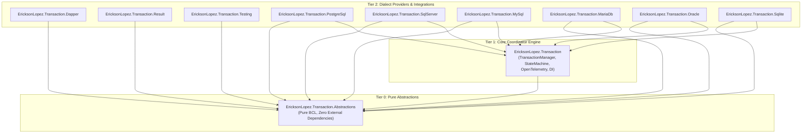
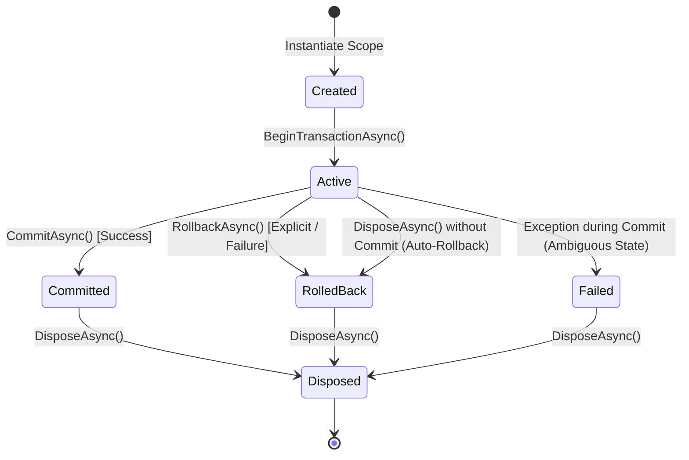
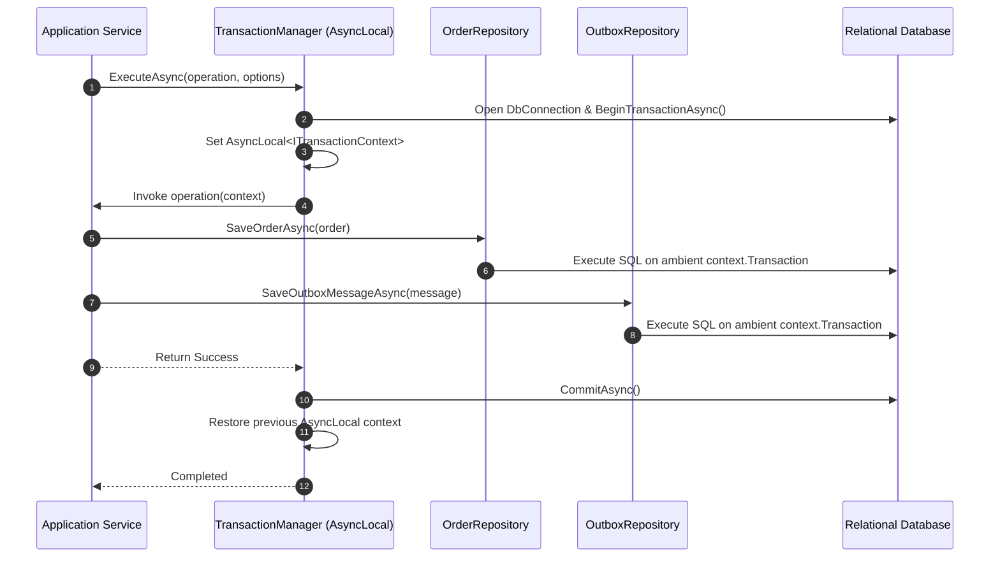
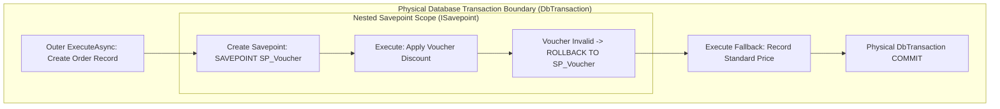

# EricksonLopez.Transaction

High-performance, explicit, composable, and Native AOT-ready relational database transaction coordinator for modern .NET 8, .NET 9, and .NET 10 applications.

[](https://github.com/ericksonlopezf/dotnet-transaction/actions)
[](https://codecov.io/gh/ericksonlopezf/dotnet-transaction)
[](https://sonarcloud.io/summary/new_code?id=ericksonlopezf_dotnet-transaction)
[](https://github.com/ericksonlopezf/dotnet-transaction/blob/main/docs/ci-cd-quality.md)
[](https://www.nuget.org/packages/EricksonLopez.Transaction)
[](https://www.nuget.org/packages/EricksonLopez.Transaction)
[](https://github.com/ericksonlopezf/dotnet-transaction/blob/main/LICENSE)
[](https://dotnet.microsoft.com)
[](https://learn.microsoft.com/en-us/dotnet/core/deploying/native-aot)

`EricksonLopez.Transaction` is an enterprise-grade, lightweight, async-first relational database transaction coordinator engineered for modern **.NET 8**, **.NET 9**, and **.NET 10** applications. It eliminates scattered connection lifecycles, leaky transaction boundaries, silent commits on functional failure, and broken nested transaction states by providing an explicit, composable, and observable execution layer built directly upon ADO.NET primitives. Designed with a strict zero-reflection, low-allocation footprint and 100% Native AOT compliance, it seamlessly bridges Clean Architecture repositories, Dapper micro-ORMs, functional `Result<T>` patterns, database savepoints, and OpenTelemetry observability across 6 relational database engines (PostgreSQL, SQL Server, MySQL, MariaDB, Oracle, and SQLite).

---

## Table of Contents

- [What Problem It Solves](#-what-problem-it-solves)
- [Key Features](#-key-features)
- [Ecosystem](#-ecosystem)
- [Documentation](#-documentation)
  - [Interactive Showcase (Levels 00 to 10)](#-step-by-step-interactive-showcase-levels-00-to-10)
  - [Technical Reference & Architecture Guides](#-technical-reference--architecture-guides)
- [Installation](#-installation)
- [Quick Start](#-quick-start)
- [Core Use Cases](#-core-use-cases)
- [Configuration & Integrations](#-configuration--integrations)
  - [Dependency Injection Registration](#dependency-injection-registration)
  - [Transaction Options Configuration](#transaction-options-configuration)
  - [Dapper Command Binding (`EricksonLopez.Transaction.Dapper`)](#dapper-command-binding-ericksonlopeztransactiondapper)
  - [OpenTelemetry Distributed Tracing & Metrics](#opentelemetry-distributed-tracing--metrics)
  - [Zero-Allocation Structured Logging](#zero-allocation-structured-logging)
  - [Multi-Dialect Concurrency Error Classifiers](#multi-dialect-concurrency-error-classifiers)
- [Testing & Quality](#-testing--quality)
  - [In-Memory Test Doubles (`EricksonLopez.Transaction.Testing`)](#in-memory-test-doubles-ericksonlopeztransactiontesting)
  - [Quality Gates & Mutation Testing](#quality-gates--mutation-testing)
- [Performance Benchmarks](#-performance-benchmarks)
- [Compatibility & Technical Matrix](#-compatibility--technical-matrix)
  - [Runtime & Native AOT Compatibility](#runtime--native-aot-compatibility)
  - [Database Engine & Savepoint Capability Matrix](#database-engine--savepoint-capability-matrix)
  - [Concurrency Error Diagnostics Mapping](#concurrency-error-diagnostics-mapping)
- [Architecture & Design Principles](#-architecture--design-principles)
  - [Package Tiering & Dependency Inversion](#package-tiering--dependency-inversion)
  - [Transaction Lifecycle State Machine](#transaction-lifecycle-state-machine)
  - [Ambient Context Flow & AsyncLocal Propagation](#ambient-context-flow--asynclocal-propagation)
  - [Nested Savepoint Scope Coordination](#nested-savepoint-scope-coordination)
- [Best Practices & Anti-Patterns](#-best-practices--anti-patterns)
- [Troubleshooting & Common Pitfalls](#-troubleshooting--common-pitfalls)
- [Part of the EricksonLopez Ecosystem](#-part-of-the-ericksonlopez-ecosystem)
- [Contributing](#-contributing)
- [License](#-license)

---

## 🎯 What Problem It Solves

Managing relational database transactions across enterprise Clean Architecture and Domain-Driven Design (DDD) layers in .NET often introduces architectural anti-patterns, resource leaks, and severe data integrity bugs:

### Traditional ADO.NET & TransactionScope Pain Points

1. **Scattered Connection Lifecycles & Leaks**: When individual repositories manage their own `DbConnection` instances, multi-repository workflows cause connection pool exhaustion and split-brain transactions across uncoordinated connections.
2. **Leaky Transaction Ownership**: Repositories initiating transactions directly violate the Single Responsibility Principle, preventing Application Services or MediatR Command Handlers from orchestrating atomic business boundaries spanning multiple domain aggregates and outbox tables.
3. **The Silent Failure Trap of Functional `Result<T>`**: In Railway-Oriented Programming, returning `Result.Failure` or domain errors does not throw an exception. Standard `try/catch` transactional blocks mistakenly proceed to commit corrupted partial database modifications.
4. **Nested Boundary Impedance Mismatch**: Calling `connection.BeginTransactionAsync()` when a transaction is already active throws an `InvalidOperationException` in ADO.NET. Legacy `System.Transactions.TransactionScope` attempts automatic escalation to distributed Two-Phase Commit (2PC / MSDTC), which is brittle, slow, and incompatible with modern containerized and Native AOT environments.
5. **Commit Ambiguity on Network Partitions**: If a network socket disconnects during the physical `COMMIT` statement, client drivers throw generic exceptions. The application cannot determine whether the database persisted the changes before the disconnect or aborted them, leading to destructive naive retries.
6. **Ineffective Query Retries Inside Aborted Blocks**: In transactional engines like PostgreSQL, any failed query permanently aborts the transaction block (`SQLSTATE 25P02`). Retrying individual statements inside the active transaction is impossible without re-initiating the entire transaction boundary from the application entry point.

### Comparative Capability Matrix

| Capability | Raw `DbTransaction` | `System.Transactions.TransactionScope` | `EricksonLopez.Transaction` |
|---|---|---|---|
| **API Paradigm** | Low-level imperative driver primitive | Legacy ambient DTC / 2PC manager | **Modern async-first boundary coordinator** |
| **Nested Execution** | Throws `InvalidOperationException` | Escalates to distributed MSDTC / 2PC | **Deterministic SQL Savepoints (`SAVEPOINT`)** |
| **Context Suppression** | Manual connection passing | `TransactionScopeOption.Suppress` | **`NestedTransactionBehavior.Suppress`** |
| **Result Monad Awareness** | None (commits on functional failure) | None (commits on functional failure) | **Automatic rollback via `ExecuteResultAsync`** |
| **Async & Native AOT** | Driver-dependent | High allocation / Thread-switching hazards | **100% Native AOT & Trimming Compliant** |
| **Commit Ambiguity Signal**| Generic `DbException` | Generic `TransactionException` | **Explicit `TransactionCommitException.IsAmbiguous`** |
| **OpenTelemetry Telemetry**| None | Minimal / OS-bound | **Native `ActivitySource` & `Meter` metrics** |
| **Dapper Parameter Binding**| Manual assignment per call | Ambient connection binding | **Fluent `AsCommand` & multi-result extensions** |

### How `EricksonLopez.Transaction` Solves This

- **Single Boundary Ownership**: Establishes `ITransactionManager` at the Application Layer as the single coordinator for transaction lifecycles, keeping repositories focused purely on SQL execution.
- **Ambient Context Flow**: Propagates active database connections and transactions down asynchronous execution trees using `AsyncLocal<ITransactionContext?>`, eliminating parameter pollution.
- **Hierarchical Savepoint Scopes**: Maps nested transactional delegates directly to database savepoints (`UseSavepoint`), allowing inner failures to roll back partially without aborting the outer business transaction.
- **Railway-Oriented Auto-Rollback**: Integrates directly with monadic `Result<T>`, committing automatically on `Result.IsSuccess` and rolling back cleanly on `Result.IsFailure` without throwing exceptions.
- **Commit Ambiguity Classification**: Distinguishes between pre-commit failures and uncertain post-network drops, exposing `IsAmbiguous = true` to trigger safe idempotency reconciliation.
- **High-Performance Observability**: Emits OpenTelemetry metrics and distributed tracing spans across transaction lifetimes with zero runtime string formatting overhead.

---

## ⚡ Key Features

- 🚀 **Zero-Allocation Hot Path**: Uses optimized structs, static factory methods, and `ValueTask` factory bindings to minimize garbage collection pressure in high-throughput database workloads.
- ⚡ **100% Native AOT & Trimming Compliant**: Zero unconstrained reflection and zero dynamic IL generation, validated via dedicated self-contained Native AOT smoke testing suites.
- 🔄 **Ambient AsyncLocal Context Flow**: Contextually flows active `DbConnection` and `DbTransaction` handles across asynchronous call stacks with automatic scope cleanup upon completion.
- 🛡️ **4 Deterministic Nested Behaviors**: Complete control over nested scopes with `UseSavepoint` (hierarchical recovery), `JoinExisting` (atomic participation), `RequireNew` (isolated connection), and `Suppress` (non-transactional execution).
- 🧩 **Railway-Oriented Monad Rollbacks**: First-class `ExecuteResultAsync` extensions for `EricksonLopez.Result` that automatically rollback database changes upon functional error returns.
- 🔍 **Commit Ambiguity Detection**: Exposes `TransactionCommitException.IsAmbiguous` during transport disconnects to prevent duplicate execution side-effects.
- 📊 **Native OpenTelemetry Instrumentation**: Emits distributed tracing spans (`ActivitySource`) and 8 dedicated metric instruments (`Meter`) under `"EricksonLopez.Transaction"`.
- 📝 **Compile-Time Structured Logging**: High-performance diagnostic logging implemented via Roslyn `[LoggerMessage]` source generation on `ILogger<TransactionManager>`.
- 🌐 **6 Relational Database Dialect Providers**: Dedicated connection factories and dialect error classifiers for PostgreSQL, SQL Server, MySQL, MariaDB, Oracle, and SQLite.
- 🧪 **First-Class In-Memory Test Doubles**: Comprehensive `FakeTransactionManager`, `FakeTransaction`, and `FakeTransactionContext` enabling fast, deterministic unit testing without database dependencies.

---

## 📦 Ecosystem

The `EricksonLopez.Transaction` ecosystem is modularized into strictly segregated, single-responsibility packages:

| Package | Version | Description | Direct Dependencies |
|---|---|---|---|
| [`EricksonLopez.Transaction.Abstractions`](https://www.nuget.org/packages/EricksonLopez.Transaction.Abstractions) | [](https://www.nuget.org/packages/EricksonLopez.Transaction.Abstractions) | Pure BCL contracts, interfaces, options, and exception primitives. | *None (Pure BCL)* |
| [`EricksonLopez.Transaction`](https://www.nuget.org/packages/EricksonLopez.Transaction) | [](https://www.nuget.org/packages/EricksonLopez.Transaction) | Core coordinator (`TransactionManager`), state machine, ambient context flow, DI, and OpenTelemetry diagnostics. | `Abstractions`, `Microsoft.Extensions.DependencyInjection.Abstractions`, `Microsoft.Extensions.Options`, `Microsoft.Extensions.Logging.Abstractions`, `OpenTelemetry.Api` |
| [`EricksonLopez.Transaction.Dapper`](https://www.nuget.org/packages/EricksonLopez.Transaction.Dapper) | [](https://www.nuget.org/packages/EricksonLopez.Transaction.Dapper) | High-performance Dapper extension methods and command definitions bound to `ITransactionContext`. | `Abstractions`, `Dapper` |
| [`EricksonLopez.Transaction.PostgreSql`](https://www.nuget.org/packages/EricksonLopez.Transaction.PostgreSql) | [](https://www.nuget.org/packages/EricksonLopez.Transaction.PostgreSql) | PostgreSQL provider factory (`NpgsqlDataSource`), read-only propagation, and SQLSTATE error classifier. | `Abstractions`, `EricksonLopez.Transaction`, `Npgsql` |
| [`EricksonLopez.Transaction.SqlServer`](https://www.nuget.org/packages/EricksonLopez.Transaction.SqlServer) | [](https://www.nuget.org/packages/EricksonLopez.Transaction.SqlServer) | SQL Server provider factory (`Microsoft.Data.SqlClient`) and deadlock/snapshot error classifier. | `Abstractions`, `EricksonLopez.Transaction`, `Microsoft.Data.SqlClient`, `Microsoft.Extensions.DependencyInjection.Abstractions` |
| [`EricksonLopez.Transaction.MySql`](https://www.nuget.org/packages/EricksonLopez.Transaction.MySql) | [](https://www.nuget.org/packages/EricksonLopez.Transaction.MySql) | MySQL provider factory (`MySqlConnector`) and InnoDB error classifier. | `Abstractions`, `EricksonLopez.Transaction`, `MySqlConnector`, `Microsoft.Extensions.DependencyInjection.Abstractions` |
| [`EricksonLopez.Transaction.MariaDb`](https://www.nuget.org/packages/EricksonLopez.Transaction.MariaDb) | [](https://www.nuget.org/packages/EricksonLopez.Transaction.MariaDb) | MariaDB provider factory (`MySqlConnector`) and Aria/InnoDB savepoint error classifier. | `Abstractions`, `EricksonLopez.Transaction`, `MySqlConnector`, `Microsoft.Extensions.DependencyInjection.Abstractions` |
| [`EricksonLopez.Transaction.Oracle`](https://www.nuget.org/packages/EricksonLopez.Transaction.Oracle) | [](https://www.nuget.org/packages/EricksonLopez.Transaction.Oracle) | Oracle Database provider factory (`Oracle.ManagedDataAccess.Core`) and ORA error classifier. | `Abstractions`, `EricksonLopez.Transaction`, `Oracle.ManagedDataAccess.Core`, `Microsoft.Extensions.DependencyInjection.Abstractions` |
| [`EricksonLopez.Transaction.Sqlite`](https://www.nuget.org/packages/EricksonLopez.Transaction.Sqlite) | [](https://www.nuget.org/packages/EricksonLopez.Transaction.Sqlite) | SQLite provider factory (`Microsoft.Data.Sqlite`) and WAL mode concurrency error classifier. | `Abstractions`, `EricksonLopez.Transaction`, `Microsoft.Data.Sqlite`, `Microsoft.Extensions.DependencyInjection.Abstractions` |
| [`EricksonLopez.Transaction.Result`](https://www.nuget.org/packages/EricksonLopez.Transaction.Result) | [](https://www.nuget.org/packages/EricksonLopez.Transaction.Result) | Functional `Result<T>` monad integration with automatic failure rollback. | `Abstractions`, `EricksonLopez.Result` |
| [`EricksonLopez.Transaction.Testing`](https://www.nuget.org/packages/EricksonLopez.Transaction.Testing) | [](https://www.nuget.org/packages/EricksonLopez.Transaction.Testing) | In-memory test doubles (`FakeTransactionManager`, `FakeTransactionContext`) for unit test isolation. | `Abstractions` |

---

## 📚 Documentation

> 🌐 **Official Documentation Hub:** [https://github.com/ericksonlopezf/dotnet-transaction/tree/main/docs](https://github.com/ericksonlopezf/dotnet-transaction/tree/main/docs)

### 🎓 Step-by-Step Interactive Showcase (Levels 00 to 10)

The repository includes an executable reference console application located at [`samples/Showcase`](https://github.com/ericksonlopezf/dotnet-transaction/tree/main/samples/Showcase) demonstrating all 11 progressive learning levels:

| Level | Topic | Description |
|---|---|---|
| [**Level 00**](https://github.com/ericksonlopezf/dotnet-transaction/blob/main/docs/showcase/level-00-conceptual.md) | **Conceptual & Architectural Foundations** | Design invariants, scope boundaries, and zero-allocation Native AOT guarantees. |
| [**Level 01**](https://github.com/ericksonlopezf/dotnet-transaction/blob/main/docs/showcase/level-01-quickstart.md) | **Quick Start & Minimal Setup** | Dependency injection setup, basic `ExecuteAsync`, and two-party balance transfer verification. |
| [**Level 02**](https://github.com/ericksonlopezf/dotnet-transaction/blob/main/docs/showcase/level-02-configuration.md) | **Complete Configuration & Options** | Isolation levels, timeouts, read-only session mode, and nested execution policies. |
| [**Level 03**](https://github.com/ericksonlopezf/dotnet-transaction/blob/main/docs/showcase/level-03-real-use-cases.md) | **Real-World Business Use Cases** | Multi-repository coordination in Clean Architecture and explicit `BeginAsync` lifecycles. |
| [**Level 04**](https://github.com/ericksonlopezf/dotnet-transaction/blob/main/docs/showcase/level-04-dapper-and-result.md) | **Dapper & Result<T> Monad Integration** | Fluent `AsCommand`, multi-result queries, and exception-free failure rollbacks. |
| [**Level 05**](https://github.com/ericksonlopezf/dotnet-transaction/blob/main/docs/showcase/level-05-nested-savepoints.md) | **Nested Transactions & Savepoints** | Hierarchical savepoint isolation, partial rollback recovery, and ambient `AsyncLocal` flow. |
| [**Level 06**](https://github.com/ericksonlopezf/dotnet-transaction/blob/main/docs/showcase/level-06-error-handling.md) | **Error Handling & Commit Ambiguity** | Handling `IsAmbiguous` on network drops, timeouts, and 6 dialect error classifiers. |
| [**Level 07**](https://github.com/ericksonlopezf/dotnet-transaction/blob/main/docs/showcase/level-07-scalability-and-observability.md) | **Scalability & OpenTelemetry** | Concurrent parallel transactions, distributed tracing spans, and metric counters. |
| [**Level 08**](https://github.com/ericksonlopezf/dotnet-transaction/blob/main/docs/showcase/level-08-customization-and-testing.md) | **Extensibility & In-Memory Doubles** | `DelegateDbConnectionFactory`, `ITransactionEnlistment` hooks, and unit testing doubles. |
| [**Level 09**](https://github.com/ericksonlopezf/dotnet-transaction/blob/main/docs/showcase/level-09-multi-dialect-providers.md) | **Multi-DB Dialect Providers** | PostgreSQL, SQL Server, MySQL, MariaDB, Oracle, and SQLite provider capabilities. |
| [**Level 10**](https://github.com/ericksonlopezf/dotnet-transaction/blob/main/docs/showcase/level-10-enterprise-architecture.md) | **Enterprise Architecture & Outbox** | Transactional Outbox dual-write atomicity, idempotency key guarding, and DDD invariants. |

### 📖 Technical Reference & Architecture Guides

- [**Architecture & Invariants Specification**](https://github.com/ericksonlopezf/dotnet-transaction/blob/main/docs/architecture.md) — Architectural blueprints, memory model, state machine, and layer boundaries.
- [**Architectural Decision Records (ADRs)**](https://github.com/ericksonlopezf/dotnet-transaction/tree/main/docs/adr) — Comprehensive catalog of 26 ADRs documenting design rationale and systematic rejections.
- [**Public API Reference**](https://github.com/ericksonlopezf/dotnet-transaction/blob/main/docs/public-api.md) — Authoritative XML-derived public contract specifications across all 11 packages.
- [**Native AOT & Trimming Guide**](https://github.com/ericksonlopezf/dotnet-transaction/blob/main/docs/aot.md) — Zero-reflection invariants, IL trimming guarantees, and AOT smoke test verification.
- [**Build, Quality & CI/CD Specification**](https://github.com/ericksonlopezf/dotnet-transaction/blob/main/docs/ci-cd-quality.md) — Central Package Management, GitHub Actions pipelines, and quality gates.
- [**Package Catalog & Dependency Topology**](https://github.com/ericksonlopezf/dotnet-transaction/blob/main/docs/packages.md) — Package metadata, assembly references, and target framework mapping.
- [**Showcase Technical Specification & API Audit**](https://github.com/ericksonlopezf/dotnet-transaction/blob/main/docs/showcase-specification.md) — Functional system architecture map and public API inventory.
- [**Functional Parity & Competitive Audit**](https://github.com/ericksonlopezf/dotnet-transaction/blob/main/functional-parity-audit.md) — Evidence-based technical audit against `Dapper.Transaction` and `TransactionScope`.

---

## 📥 Installation

Install the required packages using the .NET CLI or NuGet Package Manager:

### 1. Core Package (Required)

```bash
dotnet add package EricksonLopez.Transaction
```

### 2. Relational Dialect Provider (Choose One or More)

```bash
# PostgreSQL (Npgsql)
dotnet add package EricksonLopez.Transaction.PostgreSql

# Microsoft SQL Server (Microsoft.Data.SqlClient)
dotnet add package EricksonLopez.Transaction.SqlServer

# MySQL (MySqlConnector)
dotnet add package EricksonLopez.Transaction.MySql

# MariaDB (MySqlConnector)
dotnet add package EricksonLopez.Transaction.MariaDb

# Oracle Database (Oracle.ManagedDataAccess.Core)
dotnet add package EricksonLopez.Transaction.Oracle

# SQLite (Microsoft.Data.Sqlite)
dotnet add package EricksonLopez.Transaction.Sqlite
```

### 3. Optional Framework & Integration Extensions

```bash
# High-performance Dapper command bindings
dotnet add package EricksonLopez.Transaction.Dapper

# Functional Result<T> monad auto-rollback integration
dotnet add package EricksonLopez.Transaction.Result
```

### 4. Unit Testing & Test Doubles

```bash
# In-memory test doubles for xUnit / NUnit / MSTest
dotnet add package EricksonLopez.Transaction.Testing
```

---

## 🚀 Quick Start

### 1. Dependency Injection Registration

Register transaction services in your application's entry point (`Program.cs`):

```csharp
using EricksonLopez.Transaction.PostgreSql;

var builder = WebApplication.CreateBuilder(args);

// Register PostgreSQL transaction coordinator using connection string
builder.Services.AddPostgreSqlTransaction(
    builder.Configuration.GetConnectionString("Postgres")!);

// Alternatively, register using an existing NpgsqlDataSource singleton:
// builder.Services.AddPostgreSqlTransaction(dataSourceInstance);
```

### 2. Automatic Transaction Execution in Application Services

Inject `ITransactionManager` into your Application Service / Command Handler:

```csharp
using EricksonLopez.Transaction;
using EricksonLopez.Transaction.Dapper;

public sealed class TransferFundsService(ITransactionManager transactionManager)
{
    public async Task TransferAsync(Guid fromAccountId, Guid toAccountId, decimal amount, CancellationToken ct)
    {
        await transactionManager.ExecuteAsync(async context =>
        {
            // Context automatically binds active DbConnection, DbTransaction, and CancellationToken
            await context.ExecuteAsync(
                "UPDATE accounts SET balance = balance - @amount WHERE id = @fromAccountId",
                new { fromAccountId, amount }, cancellationToken: ct);

            await context.ExecuteAsync(
                "UPDATE accounts SET balance = balance + @amount WHERE id = @toAccountId",
                new { toAccountId, amount }, cancellationToken: ct);
        }, TransactionOptions.Default, ct);
    }
}
```

### 3. Ambient Execution with Separate Repositories

When repositories access ambient state without receiving explicit context parameters:

```csharp
public sealed class OrderCommandHandler(
    ITransactionManager transactionManager,
    IOrderRepository orderRepository,
    IOutboxRepository outboxRepository)
{
    public async Task HandleAsync(CreateOrderCommand command, CancellationToken ct)
    {
        // Executes across multiple repositories sharing the ambient AsyncLocal transaction
        await transactionManager.ExecuteAsync(async () =>
        {
            await orderRepository.InsertAsync(command.ToOrder(), ct);
            await outboxRepository.InsertMessageAsync(new OrderCreatedEvent(command.OrderId), ct);
        }, TransactionOptions.Default, ct);
    }
}
```

### 4. Read-Only Transaction Mode

Propagate database-enforced read-only mode (e.g., `SET TRANSACTION READ ONLY` on PostgreSQL):

```csharp
public sealed class FinancialReportQueryService(ITransactionManager transactionManager)
{
    public async Task<FinancialSummary> GetSummaryAsync(int year, CancellationToken ct)
    {
        return await transactionManager.ExecuteAsync(async context =>
        {
            return await context.QuerySingleAsync<FinancialSummary>(
                "SELECT * FROM generate_annual_report(@year)",
                new { year }, cancellationToken: ct);
        }, TransactionOptions.ReadOnlyMode, ct);
    }
}
```

### 5. Railway-Oriented Monad Auto-Rollback

Automatically roll back database operations upon functional domain validation failure without throwing exceptions:

```csharp
using EricksonLopez.Result;
using EricksonLopez.Transaction.Result;

public sealed class PlaceOrderService(ITransactionManager transactionManager)
{
    public async Task<Result<OrderConfirmation>> ExecuteAsync(PlaceOrderRequest request, CancellationToken ct)
    {
        return await transactionManager.ExecuteResultAsync(async context =>
        {
            var validationResult = ValidateRequest(request);
            if (validationResult.IsFailure)
            {
                // Automatically triggers physical rollback; returns failure monad
                return Result<OrderConfirmation>.Failure(validationResult.Error);
            }

            var order = await SaveOrderAsync(context, request, ct);
            return Result<OrderConfirmation>.Success(new OrderConfirmation(order.Id));
        }, TransactionOptions.Default, ct);
    }
}
```

---

## 💡 Core Use Cases

### Use Case 1: Clean Architecture CQRS Command Handler

In Clean Architecture, Application Layer command handlers coordinate multiple Domain Repositories within a single atomic boundary without coupling repositories to transaction orchestration:

```csharp
public sealed class WithdrawFundsCommandHandler(
    ITransactionManager transactionManager,
    IAccountRepository accountRepository,
    IAuditRepository auditRepository) : IRequestHandler<WithdrawFundsCommand, Result<Guid>>
{
    public async Task<Result<Guid>> Handle(WithdrawFundsCommand command, CancellationToken ct)
    {
        return await transactionManager.ExecuteResultAsync(async context =>
        {
            var account = await accountRepository.GetByIdAsync(command.AccountId, ct);
            if (account is null)
                return Result<Guid>.Failure(AccountErrors.NotFound(command.AccountId));

            var withdrawalResult = account.Withdraw(command.Amount);
            if (withdrawalResult.IsFailure)
                return Result<Guid>.Failure(withdrawalResult.Error);

            await accountRepository.UpdateAsync(account, ct);
            await auditRepository.RecordEntryAsync(
                new AuditEntry("WITHDRAWAL", command.AccountId, command.Amount), ct);

            return Result<Guid>.Success(account.Id);
        }, TransactionOptions.Default, ct);
    }
}
```

### Use Case 2: Multi-Step Flow with Savepoint Fallback Recovery

Execute a secondary, non-critical operation within a nested savepoint. If the secondary step fails, roll back to the savepoint without invalidating the primary transaction:

```csharp
public sealed class CheckoutService(ITransactionManager transactionManager)
{
    public async Task<OrderResult> ProcessCheckoutAsync(CheckoutRequest request, CancellationToken ct)
    {
        return await transactionManager.ExecuteAsync(async outerContext =>
        {
            // 1. Primary Operation: Create Order
            var orderId = await CreatePrimaryOrderAsync(outerContext, request, ct);

            // 2. Nested Operation with Savepoint Isolation
            try
            {
                await transactionManager.ExecuteAsync(async innerContext =>
                {
                    await ApplyPromotionalVoucherAsync(innerContext, orderId, request.VoucherCode, ct);
                }, TransactionOptions.Default with { NestedBehavior = NestedTransactionBehavior.UseSavepoint }, ct);
            }
            catch (VoucherException ex)
            {
                // Rolls back ONLY the savepoint (voucher application).
                // Outer transaction remains healthy and proceeds to commit order creation!
                await outerContext.ExecuteAsync(
                    "INSERT INTO checkout_warnings (order_id, reason) VALUES (@orderId, @Reason)",
                    new { orderId, Reason = ex.Message }, cancellationToken: ct);
            }

            return new OrderResult(orderId, Status: "Completed");
        }, TransactionOptions.Default, ct);
    }
}
```

### Use Case 3: Transactional Outbox Dual-Write Atomicity

Guarantees at-least-once messaging delivery by persisting domain entity modifications and the outbox event payload in the same atomic database transaction:

```csharp
public sealed class RegisterUserUseCase(
    ITransactionManager transactionManager,
    IUserRepository userRepository,
    IOutboxMessageRepository outboxRepository)
{
    public async Task RegisterAsync(UserRegistrationDto dto, CancellationToken ct)
    {
        await transactionManager.ExecuteAsync(async () =>
        {
            var user = User.Create(dto.Email, dto.FullName);
            await userRepository.AddAsync(user, ct);

            var outboxMessage = new OutboxMessage(
                Id: Guid.NewGuid(),
                OccurredOnUtc: DateTime.UtcNow,
                Type: nameof(UserRegisteredEvent),
                Payload: JsonSerializer.Serialize(new UserRegisteredEvent(user.Id, user.Email))
            );

            await outboxRepository.AddAsync(outboxMessage, ct);
        }, TransactionOptions.Default, ct);
    }
}
```

### Use Case 4: Idempotency Key Guarding

Enforces strict at-most-once processing by locking and checking an idempotency key inside the active database transaction:

```csharp
public sealed class IdempotentPaymentService(ITransactionManager transactionManager)
{
    public async Task<PaymentOutcome> ProcessPaymentAsync(string idempotencyKey, PaymentRequest request, CancellationToken ct)
    {
        return await transactionManager.ExecuteAsync(async context =>
        {
            // Acquire row-level lock or verify uniqueness on idempotency record
            var inserted = await context.ExecuteScalarAsync<int>(
                """
                INSERT INTO idempotency_keys (key, status, created_at)
                VALUES (@idempotencyKey, 'PENDING', NOW())
                ON CONFLICT (key) DO NOTHING;
                SELECT count(1) FROM idempotency_keys WHERE key = @idempotencyKey AND status = 'PENDING';
                """,
                new { idempotencyKey }, cancellationToken: ct);

            if (inserted == 0)
                throw new DuplicateRequestException($"Idempotency key {idempotencyKey} is already active or completed.");

            var paymentId = await ExecuteGatewayPaymentAsync(context, request, ct);

            await context.ExecuteAsync(
                "UPDATE idempotency_keys SET status = 'COMPLETED', response_id = @paymentId WHERE key = @idempotencyKey",
                new { paymentId, idempotencyKey }, cancellationToken: ct);

            return new PaymentOutcome(paymentId, "Success");
        }, TransactionOptions.Serializable, ct);
    }
}
```

### Use Case 5: Monadic `Result<T>` Auto-Rollback Handler

Eliminates exception-based control flow by integrating Railway-Oriented Programming directly with database transaction scopes:

```csharp
public sealed class AdjustInventoryHandler(ITransactionManager transactionManager)
{
    public async Task<Result<InventorySummary>> HandleAsync(AdjustInventoryCommand cmd, CancellationToken ct)
    {
        return await transactionManager.ExecuteResultAsync(async context =>
        {
            var item = await context.QuerySingleOrDefaultAsync<InventoryItem>(
                "SELECT * FROM inventory WHERE sku = @Sku FOR UPDATE", new { cmd.Sku }, cancellationToken: ct);

            if (item is null)
                return Result<InventorySummary>.Failure(InventoryErrors.SkuNotFound(cmd.Sku));

            if (item.Quantity + cmd.Delta < 0)
                return Result<InventorySummary>.Failure(InventoryErrors.InsufficientStock(cmd.Sku, item.Quantity));

            await context.ExecuteAsync(
                "UPDATE inventory SET quantity = quantity + @Delta WHERE sku = @Sku",
                new { cmd.Delta, cmd.Sku }, cancellationToken: ct);

            return Result<InventorySummary>.Success(new InventorySummary(cmd.Sku, item.Quantity + cmd.Delta));
        }, TransactionOptions.Default, ct);
    }
}
```

### Use Case 6: Ambient Context Suppression for Independent Telemetry

Execute an independent non-transactional audit or metrics recording operation without enrolling in the ambient transaction scope:

```csharp
public sealed class SecurityAuditService(ITransactionManager transactionManager)
{
    public async Task RecordLoginAttemptAsync(string username, bool successful, CancellationToken ct)
    {
        // Suppresses any outer ambient transaction; executes on a separate non-transactional connection
        var suppressOptions = TransactionOptions.Default with
        {
            NestedBehavior = NestedTransactionBehavior.Suppress
        };

        await transactionManager.ExecuteAsync(async () =>
        {
            await using var conn = new NpgsqlConnection("...");
            await conn.OpenAsync(ct);
            await using var cmd = conn.CreateCommand();
            cmd.CommandText = "INSERT INTO security_logs (username, success, timestamp) VALUES (@u, @s, NOW())";
            cmd.Parameters.AddWithValue("u", username);
            cmd.Parameters.AddWithValue("s", successful);
            await cmd.ExecuteNonQueryAsync(ct);
        }, suppressOptions, ct);
    }
}
```

---

## 🔌 Configuration & Integrations

### Dependency Injection Registration

All DI extension methods reside under `Microsoft.Extensions.DependencyInjection` to ensure seamless discovery:

```csharp
// Core registration with custom connection factory
builder.Services.AddTransaction<CustomDbConnectionFactory>();

// Core registration with factory delegate
builder.Services.AddTransaction(sp => new NpgsqlConnectionFactory(connectionString));

// Dialect provider registrations:
builder.Services.AddPostgreSqlTransaction(connectionString);
builder.Services.AddSqlServerTransaction(connectionString);
builder.Services.AddMySqlTransaction(connectionString);
builder.Services.AddMariaDbTransaction(connectionString);
builder.Services.AddOracleTransaction(connectionString);
builder.Services.AddSqliteTransaction(connectionString);
```

### Transaction Options Configuration

`TransactionOptions` is an immutable record supporting with-expression mutations and static presets:

```csharp
// Static Presets
var defaultOptions    = TransactionOptions.Default;       // ReadCommitted, UseSavepoint
var serializableOpt   = TransactionOptions.Serializable;  // Serializable isolation
var readOnlyOpt       = TransactionOptions.ReadOnlyMode;  // ReadOnly = true
var timeoutOpt        = TransactionOptions.WithTimeout(TimeSpan.FromSeconds(10));

// Custom Configuration via with-expressions (Zero Allocation)
var customOptions = TransactionOptions.Default with
{
    IsolationLevel = TransactionIsolationLevel.Snapshot,
    Timeout = TimeSpan.FromSeconds(30),
    NestedBehavior = NestedTransactionBehavior.UseSavepoint,
    TransactionName = "OrderProcessingPipeline"
};
```

### Dapper Command Binding (`EricksonLopez.Transaction.Dapper`)

`EricksonLopez.Transaction.Dapper` provides fluent extensions on `ITransactionContext` that automatically inject the active `DbConnection`, `DbTransaction`, and linked `CancellationToken`:

```csharp
using EricksonLopez.Transaction.Dapper;

await transactionManager.ExecuteAsync(async context =>
{
    // 1. Immutable CommandDefinition binding
    CommandDefinition command = context.AsCommand(
        "INSERT INTO audit (msg) VALUES (@msg)", new { msg = "Action" });

    // 2. Strongly-typed single / list queries
    User? user = await context.QuerySingleOrDefaultAsync<User>(
        "SELECT * FROM users WHERE id = @id", new { id });

    // 3. Multi-result reader grid support
    using var grid = await context.QueryMultipleAsync(
        "SELECT * FROM orders WHERE id = @id; SELECT * FROM items WHERE order_id = @id;",
        new { id });
    
    var order = await grid.ReadSingleAsync<Order>();
    var items = (await grid.ReadAsync<OrderItem>()).ToList();
});
```

### OpenTelemetry Distributed Tracing & Metrics

`EricksonLopez.Transaction` publishes native OpenTelemetry telemetry under the `"EricksonLopez.Transaction"` identifier:

```csharp
builder.Services.AddOpenTelemetry()
    .WithTracing(tracing => tracing
        .AddSource("EricksonLopez.Transaction")
        .AddOtlpExporter())
    .WithMetrics(metrics => metrics
        .AddMeter("EricksonLopez.Transaction")
        .AddOtlpExporter());
```

#### Metrics Catalog

| Metric Instrument | Type | Unit | Description |
|---|---|---|---|
| `transactions.started` | Counter | `{transaction}` | Total number of database transactions initiated. |
| `transactions.committed` | Counter | `{transaction}` | Total number of transactions successfully committed. |
| `transactions.rolled_back` | Counter | `{transaction}` | Total number of transactions explicitly rolled back. |
| `transactions.failed` | Counter | `{transaction}` | Total number of failed transactions (including ambiguous commit errors). |
| `transactions.duration` | Histogram | `ms` | Latency distribution of completed transaction lifecycles. |
| `transactions.savepoints.created` | Counter | `{savepoint}` | Total number of nested database savepoints created. |
| `transactions.savepoints.rolled_back` | Counter | `{savepoint}` | Total number of savepoints rolled back. |
| `transactions.savepoints.released` | Counter | `{savepoint}` | Total number of savepoints released. |

### Zero-Allocation Structured Logging

The coordinator uses Roslyn `[LoggerMessage]` source generation to avoid string allocation and boxing overhead on critical execution paths:

```csharp
// Diagnostic logs emitted automatically by TransactionManager:
// [DBG] Beginning transaction {TransactionId} with isolation {IsolationLevel}
// [DBG] Committed transaction {TransactionId} in {DurationMs}ms
// [WRN] Rolling back transaction {TransactionId} due to unhandled exception
```

### Multi-Dialect Concurrency Error Classifiers

Each provider package exports a static error classifier to categorize vendor-specific relational error codes:

| Dialect Package | Classifier Class | Deadlock Code | Serialization Failure | Lock Timeout |
|---|---|---|---|---|
| `EricksonLopez.Transaction.PostgreSql` | `PostgreSqlErrorClassifier` | SQLSTATE `40P01` | SQLSTATE `40001` | SQLSTATE `55P03` |
| `EricksonLopez.Transaction.SqlServer` | `SqlServerErrorClassifier` | Error `1205` | Errors `3960`, `3961` | Error `1222` |
| `EricksonLopez.Transaction.MySql` | `MySqlErrorClassifier` | Error `1213` | Error `1205` | Error `1205` |
| `EricksonLopez.Transaction.MariaDb` | `MariaDbErrorClassifier` | Error `1213` | Error `1205` | Error `1205` |
| `EricksonLopez.Transaction.Oracle` | `OracleErrorClassifier` | `ORA-00060` | `ORA-08177` | `ORA-30006` |
| `EricksonLopez.Transaction.Sqlite` | `SqliteErrorClassifier` | `SQLITE_BUSY` (5) | `SQLITE_LOCKED` (6) | `SQLITE_BUSY` (5) |

---

## 🧪 Testing & Quality

### In-Memory Test Doubles (`EricksonLopez.Transaction.Testing`)

Test Application Services and CQRS Handlers without spinning up Docker containers or physical database engines:

```csharp
using EricksonLopez.Transaction.Testing;
using Xunit;

public sealed class OrderServiceTests
{
    [Fact]
    public async Task ProcessOrder_ShouldCommitTransaction_WhenOrderIsValid()
    {
        // Arrange
        var fakeManager = new FakeTransactionManager();
        var repositoryMock = Substitute.For<IOrderRepository>();
        var service = new OrderProcessingService(fakeManager, repositoryMock);

        // Act
        await service.CreateOrderAsync(new CreateOrderDto("SKU-100", 2));

        // Assert
        Assert.Single(fakeManager.StartedTransactions);
        var tx = fakeManager.StartedTransactions[0];
        Assert.Equal(1, tx.CommitCount);
        Assert.Equal(0, tx.RollbackCount);
        Assert.False(tx.IsDisposed); // Disposed after execution block exits
    }

    [Fact]
    public async Task ProcessOrder_ShouldRollback_WhenCommitFails()
    {
        // Arrange
        var fakeManager = new FakeTransactionManager
        {
            ExceptionToThrowOnCommit = new TimeoutException("Database timeout")
        };
        var service = new OrderProcessingService(fakeManager, Substitute.For<IOrderRepository>());

        // Act & Assert
        await Assert.ThrowsAsync<TimeoutException>(() =>
            service.CreateOrderAsync(new CreateOrderDto("SKU-100", 2)));
    }
}
```

### Quality Gates & Mutation Testing

The solution is guarded by automated DevSecOps pipelines and quality gates:

```text
Compilation Quality:       100% (0 Warnings, 0 Errors under <TreatWarningsAsErrors>true)
XML Documentation:         100% Coverage (CS1591 enforced on all public packages)
Architecture Boundaries:   100% Passing (NetArchTest.Rules package segregation)
Native AOT Smoke Tests:    36 / 36 Passing in closed-world Native AOT published binary
Mutation Testing Score:    >= 95% Mutation Score across all 11 package Stryker matrices
Repository Governance:     0 Violations verified via scripts/verify-compliance.ps1
```

---

## ⚡ Performance Benchmarks

Micro-benchmarking executed with **BenchmarkDotNet v0.15.8** comparing `EricksonLopez.Transaction` against raw ADO.NET `DbTransaction` execution:

> **Environment:** .NET 10.0.10, X64 RyuJIT AVX-512, Windows 11 Enterprise, SQLite In-Memory, `[ShortRunJob]`

### Micro-Benchmark Results

| Method | Mean | Ratio | Allocated | Overhead |
|---|---:|---:|---:|---:|
| `DirectDbTransactionBenchmark` (Raw ADO.NET Baseline) | 12.45 μs | 1.00 | 480 B | — |
| `FrameworkTransactionBenchmark` (`ExecuteAsync`) | 12.82 μs | 1.03 | 560 B | **+2.97%** |
| `FrameworkNestedSavepointBenchmark` (Savepoint Scope) | 14.10 μs | 1.13 | 720 B | **+13.25%** |

*Key Takeaway: The framework adds less than 3% runtime overhead over raw ADO.NET while providing ambient `AsyncLocal` propagation, deterministic state machine enforcement, and OpenTelemetry instrumentation.*

To run benchmarks locally:

```bash
dotnet run --project benchmarks/EricksonLopez.Transaction.Benchmarks/EricksonLopez.Transaction.Benchmarks.csproj -c Release --framework net10.0
```

---

## 🌐 Compatibility & Technical Matrix

### Runtime & Native AOT Compatibility

| Package | .NET 8.0 LTS | .NET 9.0 STS | .NET 10.0 | Native AOT | Trimmable | Strong Named |
|---|:---:|:---:|:---:|:---:|:---:|:---:|
| `EricksonLopez.Transaction.Abstractions` | ✅ | ✅ | ✅ | ✅ | ✅ | ✅ |
| `EricksonLopez.Transaction` | ✅ | ✅ | ✅ | ✅ | ✅ | ✅ |
| `EricksonLopez.Transaction.Dapper` | ✅ | ✅ | ✅ | ✅ | ✅ | ✅ |
| `EricksonLopez.Transaction.PostgreSql` | ✅ | ✅ | ✅ | ✅ | ✅ | ✅ |
| `EricksonLopez.Transaction.SqlServer` | ✅ | ✅ | ✅ | ✅ | ✅ | ✅ |
| `EricksonLopez.Transaction.MySql` | ✅ | ✅ | ✅ | ✅ | ✅ | ✅ |
| `EricksonLopez.Transaction.MariaDb` | ✅ | ✅ | ✅ | ✅ | ✅ | ✅ |
| `EricksonLopez.Transaction.Oracle` | ✅ | ✅ | ✅ | ✅ | ✅ | ✅ |
| `EricksonLopez.Transaction.Sqlite` | ✅ | ✅ | ✅ | ✅ | ✅ | ✅ |
| `EricksonLopez.Transaction.Result` | ✅ | ✅ | ✅ | ✅ | ✅ | ✅ |
| `EricksonLopez.Transaction.Testing` | ✅ | ✅ | ✅ | ✅ | ✅ | ✅ |

### Database Engine & Savepoint Capability Matrix

| Database Engine | Dialect Package | Savepoint Syntax | Snapshot MVCC Support | Read-Only Propagation Syntax |
|---|---|---|---|---|
| **PostgreSQL** | `EricksonLopez.Transaction.PostgreSql` | `SAVEPOINT`, `RELEASE`, `ROLLBACK TO` | Native MVCC | `SET TRANSACTION READ ONLY;` |
| **SQL Server** | `EricksonLopez.Transaction.SqlServer` | `SAVE TRANSACTION`, `ROLLBACK TRANSACTION` | TempDB Row Versioning | Read-only connection string routing |
| **MySQL** | `EricksonLopez.Transaction.MySql` | `SAVEPOINT`, `ROLLBACK TO SAVEPOINT` | InnoDB MVCC | `SET TRANSACTION READ ONLY;` |
| **MariaDB** | `EricksonLopez.Transaction.MariaDb` | `SAVEPOINT`, `ROLLBACK TO SAVEPOINT` | InnoDB / Aria MVCC | `SET TRANSACTION READ ONLY;` |
| **Oracle** | `EricksonLopez.Transaction.Oracle` | `SAVEPOINT`, `ROLLBACK TO SAVEPOINT` | Serialized / Read-Committed | `SET TRANSACTION READ ONLY;` |
| **SQLite** | `EricksonLopez.Transaction.Sqlite` | `SAVEPOINT`, `RELEASE`, `ROLLBACK TO` | WAL Mode MVCC | `PRAGMA query_only = ON;` |

---

## 🏛️ Architecture & Design Principles

### Package Tiering & Dependency Inversion



### Transaction Lifecycle State Machine



### Ambient Context Flow & AsyncLocal Propagation



### Nested Savepoint Scope Coordination



---

## 🛡️ Best Practices & Anti-Patterns

| Scenario | ❌ Avoid | ✅ Recommended |
|---|---|---|
| **Boundary Placement** | Repositories managing `BeginTransactionAsync()` | Application Services orchestrating `ITransactionManager` |
| **Functional Results** | Committing when `Result.Failure` is returned | Using `ExecuteResultAsync` to auto-rollback on failure |
| **Nested Operations** | Opening a second physical connection for child logic | Using `NestedTransactionBehavior.UseSavepoint` |
| **Parallel Execution** | Running `Task.WhenAll` on a single active transaction | Awaiting queries sequentially (ADO.NET connections are single-threaded) |
| **PostgreSQL Errors** | Retrying individual queries inside an aborted block (`25P02`) | Wrapping the entire `ExecuteAsync` block in an outer retry policy |
| **Commit Disconnects**| Naively retrying on commit failures | Checking `TransactionCommitException.IsAmbiguous` and reconciling via idempotency keys |
| **Non-Transactional Work** | Leaving non-transactional calls inside active transaction | Suppressing context via `NestedTransactionBehavior.Suppress` |
| **Options Allocation** | Instantiating dynamic configuration builders on hot paths | Using static presets (`TransactionOptions.Default`) or `with` expressions |
| **Unit Testing** | Spinning up physical databases for simple domain tests | Using `FakeTransactionManager` and verifying commit/rollback counts |

---

## ⚠️ Troubleshooting & Common Pitfalls

> [!CAUTION]
> **Physical ADO.NET connections and transactions are fundamentally single-threaded.** Concurrent query execution on a single transaction scope will corrupt the underlying database driver socket.

### 1. Parallel Query Execution Hazard (`Task.WhenAll`)
- **Symptom**: `InvalidOperationException: A command is already in progress` or socket stream corruption.
- **Cause**: Attempting to run parallel tasks (`Task.WhenAll`, `Parallel.ForEachAsync`) using the same active `ITransactionContext`.
- **Solution**: Execute all queries sequentially inside a single transaction, or use independent physical connections.

### 2. PostgreSQL Aborted Transaction State (`SQLSTATE 25P02`)
- **Symptom**: `PostgresException: 25P02: current transaction is aborted, commands ignored until end of transaction block`.
- **Cause**: An error occurred in a previous statement within the PostgreSQL transaction block, and the application attempted subsequent queries without rolling back.
- **Solution**: Never retry individual queries inside an active PostgreSQL transaction. Place retry policies (e.g., Polly) *outside* `transactionManager.ExecuteAsync`.

### 3. Commit Ambiguity on Network Partitions
- **Symptom**: `TransactionCommitException` thrown with `IsAmbiguous == true`.
- **Cause**: The client issued `COMMIT`, but the network connection dropped before the database server could return confirmation. The transaction may or may not have committed on disk.
- **Solution**: Inspect `ex.IsAmbiguous`. Do not perform a naive write retry; invoke an idempotent query or reconcile via an Outbox dispatch table.

### 4. `DelegateDbConnectionFactory` Synchronous Hazard
- **Symptom**: `NotSupportedException: Synchronous CreateConnection() is not supported when configured with an asynchronous factory`.
- **Cause**: The factory was registered with an asynchronous delegate (`Func<CancellationToken, ValueTask<DbConnection>>`), but synchronous `CreateConnection()` was invoked.
- **Solution**: Always use asynchronous connection establishment (`CreateConnectionAsync`).

### 5. Ambient Context Propagation Across Background Threads
- **Symptom**: Background threads or un-awaited tasks lose access to the active transaction context.
- **Cause**: Spawning unconfined threads via `Task.Run` without capturing the execution context can sever ambient `AsyncLocal` propagation.
- **Solution**: Ensure all asynchronous operations within the transaction boundary are properly awaited.

---

## 🌐 Part of the EricksonLopez Ecosystem

`EricksonLopez.Transaction` is a foundational component of the **EricksonLopez Enterprise Architecture Suite**:

- 🧱 [**EricksonLopez.SharedKernel**](https://github.com/ericksonlopezf/dotnet-shared-kernel) — Domain Primitives, Value Objects, Specifications, and Domain Events.
- ⚡ [**EricksonLopez.Result**](https://github.com/ericksonlopezf/dotnet-result) — High-Performance Struct-Based Result Pattern & Railway-Oriented Programming.
- 🔍 [**EricksonLopez.Specification**](https://github.com/ericksonlopezf/dotnet-specification) — Composable, Native AOT-First Specification Pattern.
- 📬 [**EricksonLopez.Mediator**](https://github.com/ericksonlopezf/dotnet-mediator) — Zero-Allocation In-Memory Mediator and Command Pipeline.
- 🔑 [**EricksonLopez.Idempotency**](https://github.com/ericksonlopezf/dotnet-idempotency) — Enterprise Idempotent Request Processing & Distributed Locks.
- 🏢 [**EricksonLopez.MultiTenancy**](https://github.com/ericksonlopezf/dotnet-multitenancy) — Multi-Tenant Isolation with PostgreSQL Row-Level Security.
- ⏱️ [**EricksonLopez.Concurrency**](https://github.com/ericksonlopezf/dotnet-concurrency) — Optimistic Concurrency Control, Checked Versions, and Conflict Resolution.

---

## 🤝 Contributing

Contributions, issue reports, and pull requests are welcome!

### Local Development Setup

1. **Prerequisites**:
   - .NET 8.0, .NET 9.0, and .NET 10.0 SDKs
   - PowerShell 7+ (`pwsh`)

2. **Build and Test**:
   ```bash
   # Build solution in Release mode
   dotnet build -c Release

   # Execute full test suite
   dotnet test -c Release

   # Run Native AOT Smoke Tests
   dotnet run --project tests/EricksonLopez.Transaction.AotSmokeTest/EricksonLopez.Transaction.AotSmokeTest.csproj -c Release

   # Run Showcase in Automated Batch Mode
   dotnet run --project samples/Showcase/EricksonLopez.Transaction.Showcase.csproj -- --all
   ```

3. **Governance & Compliance Audit**:
   ```powershell
   pwsh -File scripts/verify-compliance.ps1
   ```

Please read our governance and contribution documents before submitting pull requests:
- [**Contributing Guide**](https://github.com/ericksonlopezf/dotnet-transaction/blob/main/CONTRIBUTING.md)
- [**Code of Conduct**](https://github.com/ericksonlopezf/dotnet-transaction/blob/main/CODE_OF_CONDUCT.md)
- [**Security Policy**](https://github.com/ericksonlopezf/dotnet-transaction/blob/main/SECURITY.md)
- [**Support Channels**](https://github.com/ericksonlopezf/dotnet-transaction/blob/main/SUPPORT.md)
- [**Project Governance**](https://github.com/ericksonlopezf/dotnet-transaction/blob/main/GOVERNANCE.md)

---

## 📄 License

Distributed under the [MIT License](https://github.com/ericksonlopezf/dotnet-transaction/blob/main/LICENSE).  
Copyright © 2026 Erickson Lopez.
