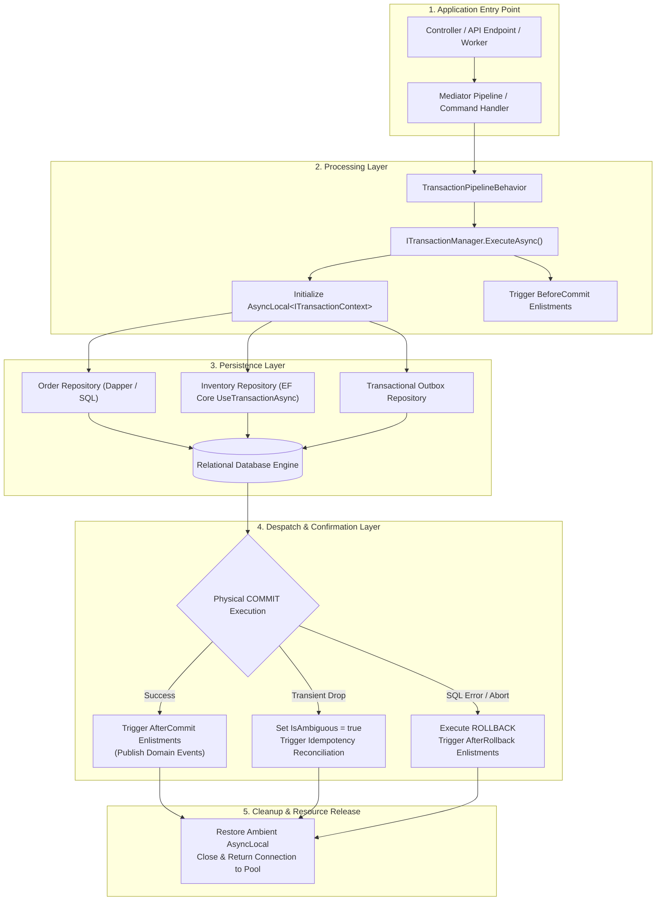
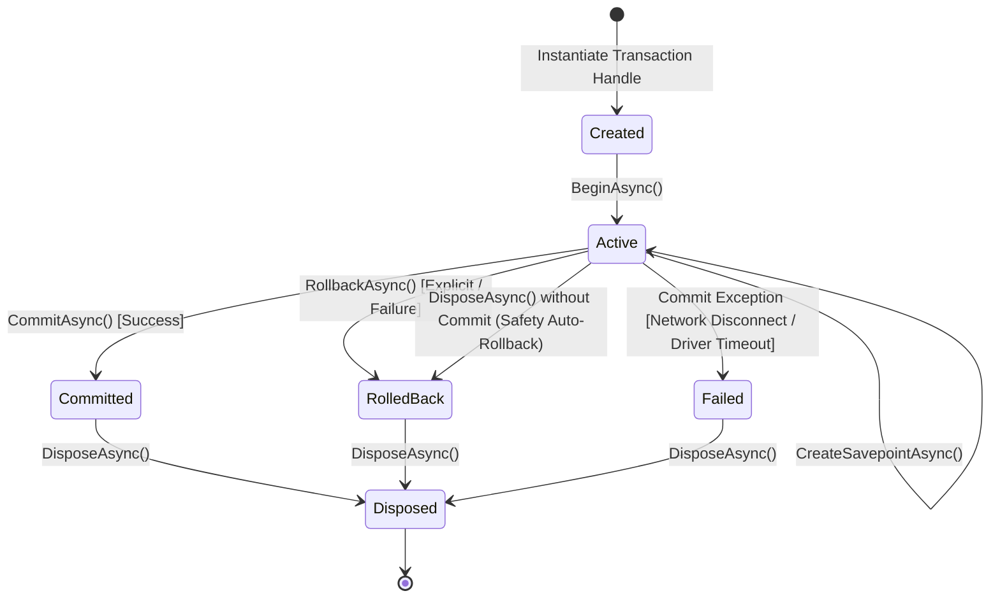
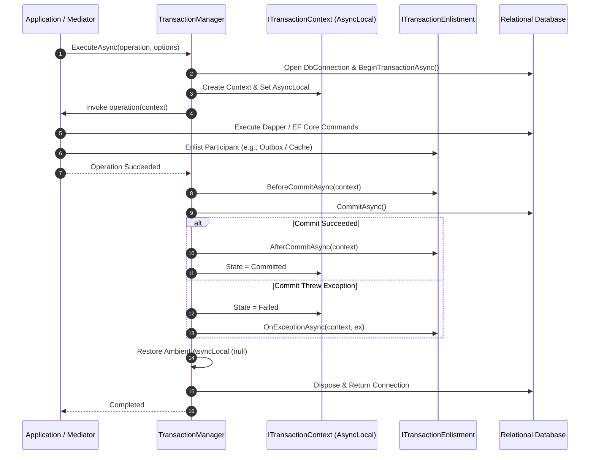
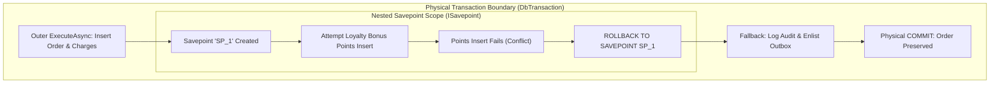

# EricksonLopez.Transaction — Architecture Specification

> **Copyright © Erickson Lopez. MIT License.**  
> **Author:** Erickson Lopez ([ericksonlopezf@gmail.com](mailto:ericksonlopezf@gmail.com))  
> **Repository:** [github.com/ericksonlopezf/dotnet-transaction](https://github.com/ericksonlopezf/dotnet-transaction)

---

## 1. System Overview & Problem Statement

In modern distributed and modular .NET enterprise applications, managing relational transaction boundaries across Clean Architecture layers presents recurring challenges:
- **Scattered Connection Lifecycles**: Uncoordinated creation of `DbConnection` instances leads to connection pool exhaustion and accidental multi-transaction split-brain states.
- **Leaky Transaction Ownership**: Repositories initiating their own transactions prevent higher-level application services from orchestrating atomic business workflows spanning multiple domain aggregates and infrastructure tables.
- **Result Pattern Failure Commit**: Functional programming patterns returning `Result<T>` or `Result.Failure` do not throw exceptions. Without explicit framework support, standard `try/catch` transactional blocks mistakenly proceed to commit corrupted partial state upon functional error returns.
- **Nested Boundary Impedance Mismatch**: ADO.NET throws exceptions when attempting nested `BeginTransactionAsync()` calls on active connections, while legacy `TransactionScope` attempts dangerous escalation to distributed Two-Phase Commit (2PC / MSDTC).
- **Commit Ambiguity Disconnects**: Network drops occurring during the physical `COMMIT` phase leave client applications uncertain whether state was persisted or aborted.

`EricksonLopez.Transaction` solves these problems by providing an explicit, composable, zero-reflection, and observable transaction coordination framework built natively on top of `DbConnection` and `DbTransaction`.

---

## 2. Package Topology & Dependency Architecture

The framework is architected with strict package segregation across three tiers (Pure Abstractions, Core Engine, and Integration/Dialect Extensions):

```mermaid
graph TD
    subgraph Tier0 ["Tier 0: Pure Abstractions"]
        Abs["EricksonLopez.Transaction.Abstractions<br/>(Pure BCL, Zero Dependencies)"]
    end

    subgraph Tier1 ["Tier 1: Core Engine"]
        Core["EricksonLopez.Transaction<br/>(TransactionManager, StateMachine, Diagnostics, DI)"]
    end

    subgraph Tier2Integrations ["Tier 2: Ecosystem Integrations"]
        Dapper["EricksonLopez.Transaction.Dapper<br/>(CommandDefinition, QueryMultiple)"]
        ResultPkg["EricksonLopez.Transaction.Result<br/>(ExecuteResultAsync, Result Auto-Rollback)"]
        Testing["EricksonLopez.Transaction.Testing<br/>(FakeTransactionManager, In-Memory Fakes)"]
        Mediator["EricksonLopez.Transaction.Mediator<br/>(TransactionPipelineBehavior)"]
        EFCore["EricksonLopez.Transaction.EntityFrameworkCore<br/>(DbContext UseTransactionAsync)"]
        Resilience["EricksonLopez.Transaction.Resilience<br/>(Polly HandleAmbiguousCommit)"]
        Analyzers["EricksonLopez.Transaction.Analyzers<br/>(Roslyn Connection Analyzer: ELT001)"]
    end

    subgraph Tier2Dialects ["Tier 2: Relational Dialect Providers"]
        PG["EricksonLopez.Transaction.PostgreSql<br/>(NpgsqlDataSource, SQLSTATE 40001/40P01/25P02)"]
        MSSQL["EricksonLopez.Transaction.SqlServer<br/>(Microsoft.Data.SqlClient, Error 1205/3960)"]
        MySQL["EricksonLopez.Transaction.MySql<br/>(MySqlConnector, Error 1213/1205)"]
        MariaDB["EricksonLopez.Transaction.MariaDb<br/>(MySqlConnector, Aria/InnoDB Savepoints)"]
        Oracle["EricksonLopez.Transaction.Oracle<br/>(Oracle.ManagedDataAccess.Core, ORA-00060)"]
        Sqlite["EricksonLopez.Transaction.Sqlite<br/>(Microsoft.Data.Sqlite, SQLITE_BUSY/LOCKED)"]
    end

    Core --> Abs
    Dapper --> Abs
    ResultPkg --> Abs
    Testing --> Abs
    Mediator --> Abs
    Mediator --> ResultPkg
    EFCore --> Abs
    Resilience --> Abs
    Analyzers --> Abs

    PG --> Abs
    PG --> Core
    MSSQL --> Abs
    MSSQL --> Core
    MySQL --> Abs
    MySQL --> Core
    MariaDB --> Abs
    MariaDB --> Core
    Oracle --> Abs
    Oracle --> Core
    Sqlite --> Abs
    Sqlite --> Core
```



---

## 3. End-to-End System Flow (Phase 2 Functional Map)

The following diagram illustrates the complete execution flow from application entry point down to physical persistence, outbox dispatch, confirmation, and resource cleanup:



---

## 4. Core Types Design & Public Contracts

### 52 Public API Elements Summary

The public API is divided into 15 packages. Key contracts include:

| Interface / Type | Package | Responsibility |
|---|---|---|
| `ITransactionManager` | `Abstractions` | Primary Coordinator: orchestrates automatic (`ExecuteAsync`) and explicit (`BeginAsync`) transaction boundaries. |
| `ITransaction` | `Abstractions` | Transaction Lifecycle Handle: encapsulates explicit `CommitAsync`, `RollbackAsync`, and `CreateSavepointAsync` controls. |
| `ITransactionContext` | `Abstractions` | Ambient Context Handle: exposes active `Connection`, `Transaction`, `TransactionState`, cancellation tokens, and enlistments. |
| `ISavepoint` | `Abstractions` | Nested Savepoint Handle: controls partial rollback (`RollbackAsync`) and release (`ReleaseAsync`) within an active transaction. |
| `ITransactionEnlistment` | `Abstractions` | Lifecycle Participant: provides hooks: `BeforeCommitAsync`, `AfterCommitAsync`, `AfterRollbackAsync`, `OnExceptionAsync`. |
| `IDbConnectionFactory` | `Abstractions` | Abstract Connection Provider: resolves engine-specific `DbConnection` instances asynchronously. |
| `IDatabaseDialect` | `Abstractions` | Dialect Specification: encapsulates savepoint syntax, command formatting, and error classification. |
| `TransactionOptions` | `Abstractions` | Immutable Configuration: defines `IsolationLevel`, `Timeout`, `ReadOnly`, `NestedBehavior`, `SanitizeTelemetryMetadata`, and `TransactionName`. |
| `TransactionState` | `Abstractions` | State Enum: `Created`, `Active`, `Committed`, `RolledBack`, `Failed`, `Disposed`. |
| `NestedTransactionBehavior` | `Abstractions` | Policy Enum: `UseSavepoint`, `JoinExisting`, `RequireNew`, `Suppress`. |
| `TransactionManager` | `Transaction` | Concrete Coordinator: thread-safe state machine, `AsyncLocal` ambient propagation, and OpenTelemetry instrumentation. |
| `TransactionPipelineBehavior<TRequest, TResponse>` | `Mediator` | Declarative Mediator Behavior: enlists command handlers in transactions matching `ITransactionalCommandOptions` options. |
| `DbContextTransactionExtensions` | `EntityFrameworkCore` | EF Core Bridge: synchronizes `DbContext` with ambient `ITransactionContext` via `UseTransactionAsync`. |
| `PollyTransactionExtensions` | `Resilience` | Resilience Bridge: executes transient retry policies around outer transaction boundaries. |

---

## 5. Transaction State Machine & Transitions

The transaction lifecycle is governed by an explicit state machine (`TransactionStateMachine`) ensuring deterministic, thread-safe transitions:



### State Machine Invariants
1. **At-Most-Once Commit**: Calling `CommitAsync()` on an already committed, rolled-back, or failed transaction throws `TransactionStateException`.
2. **Auto-Rollback on Dispose**: If an active transaction is disposed without an explicit successful commit, `DisposeAsync()` automatically executes a safe rollback.
3. **Commit Failure Ambiguity**: If an exception occurs during physical ADO.NET `CommitAsync()`, state transitions to `Failed` and `TransactionCommitException.IsAmbiguous` is set to `true` if the failure occurred after the commit command was dispatched to the socket.

---

## 6. Ambient Context Flow & Sequence Diagram

`TransactionManager` coordinates transactional execution across asynchronous call stacks via `AsyncLocal<ITransactionContext?>`:



---

## 7. Nested Transaction Behaviors & Savepoint Semantics

When `ExecuteAsync` or `BeginAsync` is invoked while an ambient transaction is already active, `TransactionManager` evaluates `TransactionOptions.NestedBehavior`:

1. **`UseSavepoint` (Default)**: Creates an internal relational `ISavepoint` (`SavepointTransactionScope`). If the inner scope throws an unhandled exception caught by the outer caller, only the savepoint is rolled back (`ROLLBACK TO SAVEPOINT`), leaving the outer transaction healthy.
2. **`JoinExisting`**: Enlists in the active transaction without creating savepoints (`JoinExistingTransactionScope`). Any failure in the inner scope invalidates the whole transaction (all-or-nothing participation).
3. **`RequireNew`**: Suspends the ambient transaction and opens a completely independent physical database connection and transaction.
4. **`Suppress`**: Suspends the ambient transaction context (`SuppressedTransactionScope`), executing inner operations non-transactionally without ambient context pollution. Upon disposal, the outer ambient context is safely restored.



---

## 8. Mediator Pipeline & Declarative Boundaries

With `EricksonLopez.Transaction.Mediator`, transactional boundaries are managed using pipeline behaviors. The `TransactionPipelineBehavior<TRequest, TResponse>` inspects whether the incoming command implements `ITransactionalCommandOptions` at runtime to resolve custom transaction options without reflection.

> **Note:** The `[Transactional]` attribute is a **metadata marker** for documentation and tooling purposes. It is **not** inspected by the pipeline at runtime. To configure runtime transaction options, implement `ITransactionalCommandOptions` on the command class.

```mermaid
sequenceDiagram
    autonumber
    participant Client as API Controller
    participant Pipe as Mediator Pipeline
    participant TxBehavior as TransactionPipelineBehavior
    participant TM as ITransactionManager
    participant Handler as CreateOrderCommandHandler
    participant DB as Relational Database

    Client->>Pipe: Send(CreateOrderCommand)
    Pipe->>TxBehavior: Handle(command)
    TxBehavior->>TxBehavior: Check ITransactionalCommandOptions (cast, no reflection)
    TxBehavior->>TM: ExecuteAsync(options)
    TM->>DB: BeginTransactionAsync()
    TM->>Handler: Handle(command, cancellationToken)
    Handler->>DB: Insert Order & Items
    Handler-->>TM: Result&lt;OrderResponse&gt;.Success
    TM->>DB: CommitAsync()
    TM-->>TxBehavior: Success
    TxBehavior-->>Pipe: Response
    Pipe-->>Client: 200 OK
```

---

## 9. Error Handling & Recovery Decision Tree

```mermaid
flowchart TD
    ERR["Exception Occurs During Execution"] --> CHECK_TYPE{"At What Stage Did Failure Occur?"}
    
    CHECK_TYPE -->|Inside Operation Delegate| INNER["Operation Exception"]
    CHECK_TYPE -->|During CommitAsync()| COMMIT_FAIL["Commit Exception"]
    
    INNER --> NESTED_CHECK{"Is Active Scope a Savepoint?"}
    NESTED_CHECK -->|Yes (UseSavepoint)| SP_ROLL["Execute ROLLBACK TO SAVEPOINT<br/>Outer Transaction Remains Active"]
    NESTED_CHECK -->|No (Root / JoinExisting)| ROOT_ROLL["Execute Full ROLLBACK<br/>Trigger AfterRollback Enlistments"]
    
    COMMIT_FAIL --> AMBIGUOUS_CHECK{"Was Commit Command Dispatched to Socket?"}
    AMBIGUOUS_CHECK -->|Yes (Network Drop / Timeout)| MARK_AMBIGUOUS["Wrap in TransactionCommitException<br/>Set IsAmbiguous = true"]
    AMBIGUOUS_CHECK -->|No (Driver Validation Failure)| MARK_UNAMBIGUOUS["Wrap in TransactionCommitException<br/>Set IsAmbiguous = false"]
    
    MARK_AMBIGUOUS --> RECONCILE["Idempotency Reconciliation:<br/>Check Outbox / Status by Business Key"]
    ROOT_ROLL --> RETRY_CHECK{"Is Exception Transient Concurrency Error?<br/>(40001, 1205, ORA-00060)"}
    RETRY_CHECK -->|Yes| RESILIENCE["Outer Resilience Policy Retries Entire Boundary"]
    RETRY_CHECK -->|No| RETHROW["Rethrow Exception to Caller"]
```

---

## 10. Non-Functional Invariants & Architectural Rejections

### Core Invariants
- **Zero Reflection in Hot Paths**: All state transitions, context lookups, and parameter bindings execute without unconstrained reflection.
- **Native AOT & Trimming**: 100% compliant with .NET `PublishAot` and trimming analyzers (`EnableTrimAnalyzer=true`).
- **Low Allocation Footprint**: Reusable structs, static options presets, and `ValueTask` bindings used across critical execution paths.
- **High-Performance Structured Logging**: Zero-allocation logging implemented via `[LoggerMessage]` source generator in `TransactionManager`.

### Systematic Architectural Rejections
1. **Rejection of Distributed 2PC (MSDTC)**: Distributed two-phase commit introduces severe availability bottlenecks and blocking locks. Distributed consistency must be achieved via Sagas and the Transactional Outbox pattern ([ADR-012](decisions/index.md)).
2. **Rejection of Internal Query Retries**: Retrying individual SQL statements inside an aborted transaction block is invalid (e.g., PostgreSQL `25P02`). Retries must wrap the entire transaction boundary from the Application layer ([ADR-011](decisions/index.md)).
3. **Rejection of ORM Change Tracking in Coordinator**: `EricksonLopez.Transaction` controls the *transaction boundary*, leaving object-relational mapping and query generation to dedicated libraries (Dapper, ADO.NET, EF Core) ([ADR-023](decisions/index.md)).
