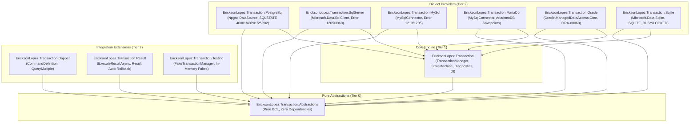
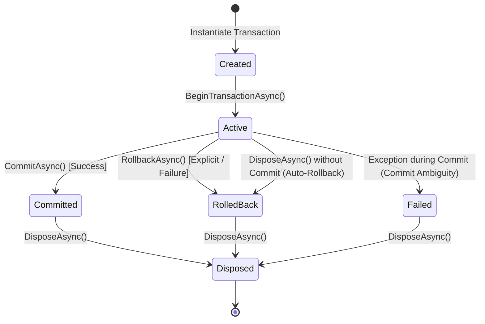
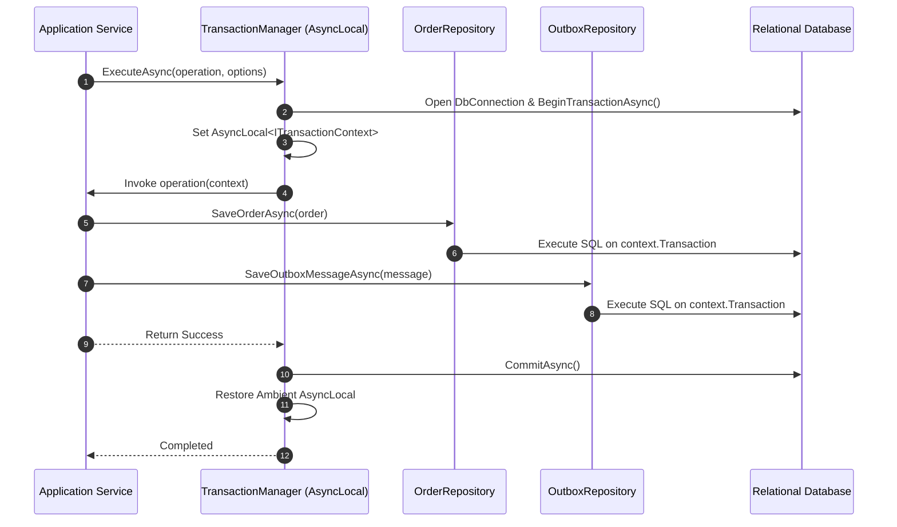
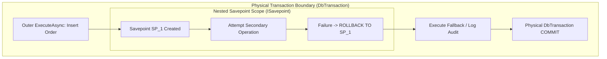

# EricksonLopez.Transaction — Architecture Specification

> **Copyright © Erickson Lopez. MIT License.**  
> **Author:** Erickson Lopez ([ericksonlopezf@gmail.com](mailto:ericksonlopezf@gmail.com))  
> **Repository:** [github.com/ericksonlopezf/dotnet-transaction](https://github.com/ericksonlopezf/dotnet-transaction)

---

## 1. System Overview & Problem Statement

In modern distributed and modular .NET enterprise applications, managing relational transaction boundaries across Clean Architecture layers presents recurring challenges:
- **Scattered Connection Lifecycles**: Uncoordinated creation of `DbConnection` instances leads to connection pool exhaustion and accidental multi-transaction split-brain states.
- **Leaky Transaction Ownership**: Repositories initiating their own transactions prevent higher-level application services from orchestrating atomic business workflows spanning multiple domain aggregates and infrastructure tables.
- **Result Pattern Failure Commit**: Functional programming patterns returning `Result<T>` or `Result.Failure` do not throw exceptions. Without explicit framework support, database transactions commit corrupted state upon functional error returns.
- **Nested Boundary Impedance Mismatch**: ADO.NET throws exceptions when attempting nested `BeginTransactionAsync()` calls on active connections.
- **Commit Ambiguity Disconnects**: Network drops occurring during the physical `COMMIT` phase leave client applications uncertain whether state was persisted or aborted.

`EricksonLopez.Transaction` solves these problems by providing an explicit, composable, zero-reflection, and observable transaction coordination framework built natively on top of `DbConnection` and `DbTransaction`.

---

## 2. Package Topology & Dependency Architecture

The framework is architected with strict package segregation. Core abstractions reside in a pure BCL package, while concrete dialect adapters, integration extensions, and test doubles are isolated in dedicated packages:



---

## 3. Core Types Design & Public Contracts

### Contract Matrix

| Interface / Type | Role | Responsibility |
|---|---|---|
| `ITransactionManager` | Primary Coordinator | Orchestrates automatic (`ExecuteAsync`) and explicit (`BeginAsync`) transaction boundaries. |
| `ITransaction` | Transaction Lifecycle Handle | Encapsulates explicit `CommitAsync`, `RollbackAsync`, and `CreateSavepointAsync` controls. |
| `ITransactionContext` | Ambient Context Handle | Exposes active `Connection`, `Transaction`, `TransactionState`, cancellation tokens, and enlistments. |
| `ISavepoint` | Nested Savepoint Handle | Controls partial rollback (`RollbackAsync`) and release (`ReleaseAsync`) within an active transaction. |
| `ITransactionEnlistment` | Lifecycle Participant | Provides hooks: `BeforeCommitAsync`, `AfterCommitAsync`, `AfterRollbackAsync`, `OnExceptionAsync`. |
| `TransactionOptions` | Immutable Configuration | Defines `IsolationLevel`, `Timeout`, `ReadOnly`, `NestedBehavior`, and `TransactionName`. |
| `TransactionState` | State Enum | `Created`, `Active`, `Committed`, `RolledBack`, `Failed`, `Disposed`. |

---

## 4. Transaction State Machine & Transitions

The transaction lifecycle is governed by an explicit state machine (`TransactionStateMachine`) ensuring deterministic, thread-safe transitions:



### State Machine Invariants
1. **At-Most-Once Commit**: Calling `CommitAsync()` on an already committed or rolled-back transaction throws `TransactionStateException`.
2. **Auto-Rollback on Dispose**: If an active transaction is disposed without an explicit successful commit, `DisposeAsync()` automatically executes a safe rollback.
3. **Commit Failure Ambiguity**: If an exception occurs during the physical ADO.NET `CommitAsync()` call, the state transitions to `Failed` and `TransactionCommitException.IsAmbiguous` is set to `true`.

---

## 5. Ambient Context Propagation (`AsyncLocal`)

`TransactionManager` coordinates transactional execution across asynchronous execution contexts via `AsyncLocal<ITransactionContext?>`:
- When entering `ExecuteAsync`, the ambient context is populated with the active `ITransactionContext`.
- Nested asynchronous calls down the call stack (repositories, domain services, handlers) automatically inherit access to the active connection and transaction without passing explicit handles.
- Upon exiting `ExecuteAsync` (whether by commit, rollback, or exception), the ambient context is restored to its prior state.



---

## 6. Nested Transaction Behaviors & Savepoint Semantics

When `ExecuteAsync` or `BeginAsync` is invoked while an ambient transaction is already active, `TransactionManager` evaluates `TransactionOptions.NestedBehavior`:

1. **`UseSavepoint` (Default)**: Creates an internal relational `ISavepoint` (`SavepointTransactionScope`). If the inner scope throws an unhandled exception caught by the outer caller, only the savepoint is rolled back (`ROLLBACK TO SAVEPOINT`), leaving the outer transaction healthy.
2. **`JoinExisting`**: Enlists in the active transaction without creating savepoints (`JoinExistingTransactionScope`). Any failure in the inner scope invalidates the whole transaction (all-or-nothing participation).
3. **`RequireNew`**: Suspends the ambient transaction and opens a completely independent physical database connection and transaction.
4. **`Suppress`**: Suspends the ambient transaction context (`SuppressedTransactionScope`), executing inner operations non-transactionally without ambient context pollution. Upon disposal, the outer ambient context is safely restored.



---

## 7. ReadOnly Transaction Mode Propagation

When `TransactionOptions.ReadOnly` is configured:
- On PostgreSQL (`EricksonLopez.Transaction.PostgreSql`), the coordinator executes `SET TRANSACTION READ ONLY;` immediately after transaction initiation.
- On supported database drivers, this guarantees driver-level and engine-level enforcement against unintentional write operations, optimizing read-replica routing and row versioning.

---

## 8. Functional Result Monad Integration (`EricksonLopez.Result`)

The `EricksonLopez.Transaction.Result` integration bridges Railway-Oriented Programming with relational transaction boundaries:
- `ExecuteResultAsync` evaluates the returned `Result<T>`.
- If `Result.IsSuccess`, the transaction commits automatically.
- If `Result.IsFailure`, the coordinator automatically rolls back the transaction without requiring exceptions, preserving functional error handling semantics:

```csharp
Result<OrderResponse> result = await transactionManager.ExecuteResultAsync(async context =>
{
    var validation = Validate(request);
    if (validation.IsFailure)
    {
        // Triggers automatic rollback without throwing exceptions
        return Result<OrderResponse>.Failure(validation.Error);
    }

    var order = await repository.CreateOrderAsync(context, request);
    return Result<OrderResponse>.Success(order);
});
```

---

## 9. Multi-Dialect Error Classifiers

Different database engines communicate concurrency conflicts and deadlocks using vendor-specific error codes. `EricksonLopez.Transaction` embeds dedicated error classifiers across 6 relational database engines:

| Engine | Error Classifier | Deadlock Detection | Serialization Conflict | Lock Timeout |
|---|---|---|---|---|
| **PostgreSQL** | `PostgreSqlErrorClassifier` | SQLSTATE `40P01` | SQLSTATE `40001` | SQLSTATE `55P03` |
| **SQL Server** | `SqlServerErrorClassifier` | Error Number `1205` | Error Numbers `3960`, `3961` | Error Number `1222` |
| **MySQL** | `MySqlErrorClassifier` | Error Number `1213` | Error Number `1205` | Error Number `1205` |
| **MariaDB** | `MariaDbErrorClassifier` | Error Number `1213` | Error Number `1205` | Error Number `1205` |
| **Oracle** | `OracleErrorClassifier` | `ORA-00060` | `ORA-08177` | `ORA-30006` |
| **SQLite** | `SqliteErrorClassifier` | `SQLITE_BUSY` (5) | `SQLITE_LOCKED` (6) | `SQLITE_BUSY` (5) |

---

## 10. Non-Functional Invariants & Architectural Rejections

### Invariants
- **Zero Reflection in Hot Paths**: All state transitions, context lookups, and parameter bindings execute without unconstrained reflection.
- **Native AOT & Trimming**: 100% compliant with .NET `PublishAot` and trimming analyzers (`EnableTrimAnalyzer=true`).
- **Low Allocation**: Reusable structs and `ValueTask` bindings used across critical execution paths.
- **High-Performance Structured Logging**: Zero-allocation logging implemented via `[LoggerMessage]` source generator in `TransactionManager`.

### Systematic Architectural Rejections
1. **Rejection of Distributed 2PC (MSDTC)**: Distributed two-phase commit over networks introduces severe availability bottlenecks and blocking locks ([ADR-012](decisions/index.md)). Distributed consistency must be achieved via Sagas and the Transactional Outbox pattern.
2. **Rejection of Internal Retry Engines**: Retrying individual SQL statements inside an aborted transaction block is invalid (e.g., PostgreSQL `25P02`). Retries must wrap the entire transaction boundary from the Application layer ([ADR-011](decisions/index.md)).
3. **Rejection of ORM Change Tracking**: `EricksonLopez.Transaction` controls the *transaction boundary*, leaving object-relational mapping and query generation to dedicated libraries (Dapper, ADO.NET) ([ADR-023](decisions/index.md)).
