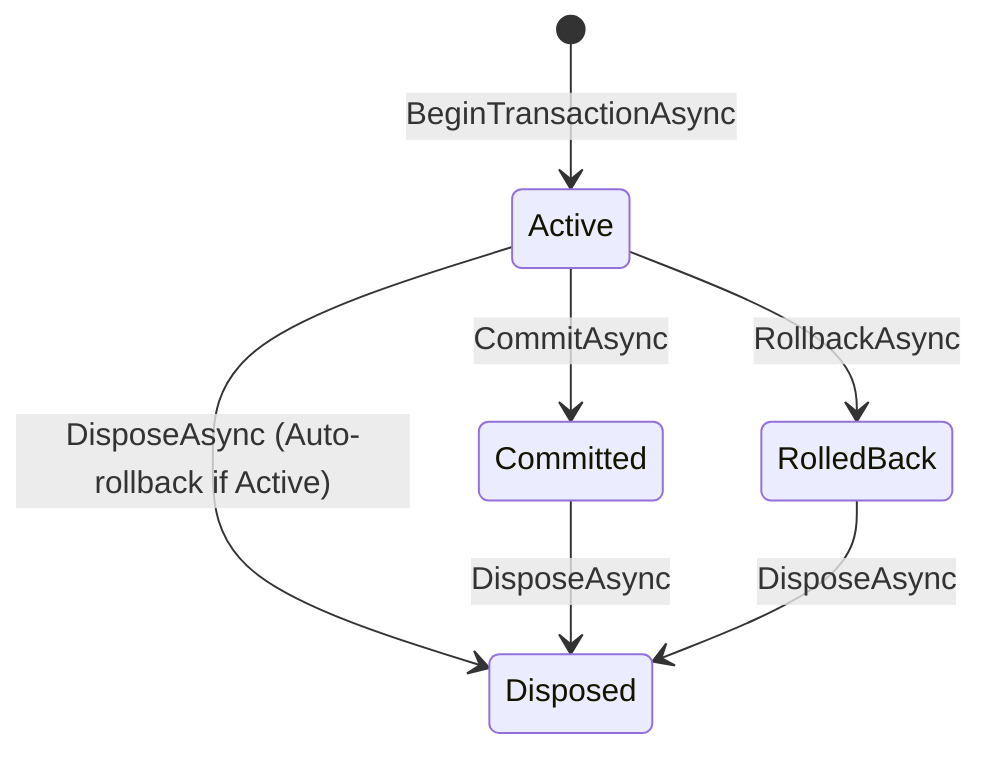

# Master Feature & Database Transaction Matrix

This document provides a comprehensive technical reference detailing transaction management capabilities, isolation levels, savepoint dialect SQL translations, and Native AOT compatibility across the `EricksonLopez.Transaction` ecosystem.

---

## 1. Database Dialect Transaction Matrix

| Database Engine | Integration Package | Savepoint SQL Dialect | Rollback to Savepoint SQL | Release Savepoint SQL | Default Isolation Level | Error Classifier |
| :--- | :--- | :--- | :--- | :--- | :--- | :--- |
| **PostgreSQL** | `EricksonLopez.Transaction.PostgreSql` | `SAVEPOINT sp_name` | `ROLLBACK TO SAVEPOINT sp_name` | `RELEASE SAVEPOINT sp_name` | `ReadCommitted` | `PostgreSqlErrorClassifier` |
| **SQL Server** | `EricksonLopez.Transaction.SqlServer` | `SAVE TRANSACTION sp_name` | `ROLLBACK TRANSACTION sp_name` | N/A (Implicit release on commit) | `ReadCommitted` | `SqlServerErrorClassifier` |
| **MySQL** | `EricksonLopez.Transaction.MySql` | `SAVEPOINT sp_name` | `ROLLBACK TO SAVEPOINT sp_name` | `RELEASE SAVEPOINT sp_name` | `RepeatableRead` | `MySqlErrorClassifier` |
| **MariaDB** | `EricksonLopez.Transaction.MariaDb` | `SAVEPOINT sp_name` | `ROLLBACK TO SAVEPOINT sp_name` | `RELEASE SAVEPOINT sp_name` | `RepeatableRead` | `MariaDbErrorClassifier` |
| **Oracle** | `EricksonLopez.Transaction.Oracle` | `SAVEPOINT sp_name` | `ROLLBACK TO SAVEPOINT sp_name` | N/A (Implicit release) | `ReadCommitted` | `OracleErrorClassifier` |
| **SQLite** | `EricksonLopez.Transaction.Sqlite` | `SAVEPOINT sp_name` | `ROLLBACK TO sp_name` | `RELEASE sp_name` | `Serializable` | `SqliteErrorClassifier` |

---

## 2. Nested Transaction Scopes Matrix

| Behavior (`NestedTransactionBehavior`) | Active Ambient Transaction | Action Taken | Failure in Scope | Success in Scope |
| :--- | :---: | :--- | :--- | :--- |
| **`UseSavepoint`** | Yes | Creates named `ISavepoint` | Rolls back to savepoint; outer tx remains healthy | Releases savepoint; outer tx continues |
| **`JoinExisting`** | Yes | Participates directly in active tx | Invalidation of entire outer transaction | Outer transaction proceeds |
| **`RequireNew`** | Yes | Suspends ambient tx; acquires fresh connection | Independent rollback | Independent commit |
| **`Suppress`** | Yes | Suspends ambient tx; executes non-transactionally | Standard error bubbling | Direct non-transactional mutation |

---

## 3. Transaction State Machine Lifecycle

| State (`TransactionState`) | Transitions Allowed | Auto-Rollback on Dispose | Can Execute Queries |
| :--- | :--- | :---: | :---: |
| **`Active`** | `Committed`, `RolledBack`, `Disposed` | Yes (Safe Rollback) | Yes |
| **`Committed`** | `Disposed` | No | No (Connection finalized) |
| **`RolledBack`** | `Disposed` | No | No (Connection finalized) |
| **`Disposed`** | Final state | No | No |

---

## 4. Ecosystem & Framework Interoperability

| Integration | Package | Key Mechanism | Performance Characteristics |
| :--- | :--- | :--- | :--- |
| **Dapper** | `EricksonLopez.Transaction.Dapper` | `TransactionDapperExtensions` | Zero-allocation pass-through of `DbConnection` and `DbTransaction` |
| **EricksonLopez.Result** | `EricksonLopez.Transaction.Result` | `TransactionResultExtensions` | Automatic rollback when delegate returns `Result.Failure` |
| **Testing** | `EricksonLopez.Transaction.Testing` | `FakeTransactionManager`, `FakeTransactionContext` | Pure in-memory unit testing without database instances |
| **OpenTelemetry** | `EricksonLopez.Transaction` (Core) | `TransactionDiagnostics` | Spans for `Transaction.Execute`, metrics for commit/rollback durations |
