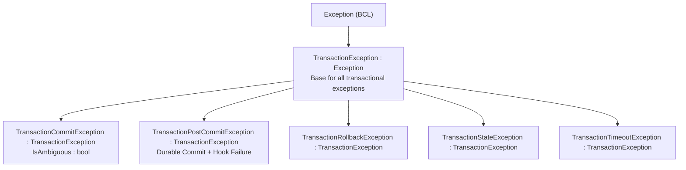

# EricksonLopez.Transaction — Public API Reference

> **Copyright © Erickson Lopez. MIT License.**
> **Author:** Erickson Lopez ([ericksonlopezf@gmail.com](mailto:ericksonlopezf@gmail.com))
> **Repository:** [github.com/ericksonlopezf/dotnet-transaction](https://github.com/ericksonlopezf/dotnet-transaction)

---

## Overview

This document is the authoritative public API reference for all packages in the `EricksonLopez.Transaction` ecosystem, derived directly from source code and XML documentation comments. All types target `net8.0;net9.0;net10.0` unless noted otherwise.

---

## Package: `EricksonLopez.Transaction.Abstractions`

Pure BCL contracts with zero external dependencies. All other packages in the ecosystem depend on this package.

**Namespace**: `EricksonLopez.Transaction`

---

### `ITransactionManager` (interface)

Primary coordinator for creating, executing, and orchestrating database transaction boundaries.

```csharp
public interface ITransactionManager
```

| Member | Signature | Description |
|---|---|---|
| `CurrentContext` | `ITransactionContext? CurrentContext { get; }` | Gets the ambient transaction context on the current asynchronous flow, or `null` if no transaction is active. |
| `BeginAsync` | `Task<ITransaction> BeginAsync(TransactionOptions? options = null, CancellationToken cancellationToken = default)` | Begins a new transaction explicitly with the specified options. |
| `ExecuteAsync` | `Task ExecuteAsync(Func<ITransactionContext, Task> operation, TransactionOptions? options = null, CancellationToken cancellationToken = default)` | Executes a delegate within an automatic transaction boundary (context-receiving overload). |
| `ExecuteAsync` | `Task ExecuteAsync(Func<Task> operation, TransactionOptions? options = null, CancellationToken cancellationToken = default)` | Executes a parameterless delegate within an automatic transaction boundary. |
| `ExecuteAsync<TResult>` | `Task<TResult> ExecuteAsync<TResult>(Func<ITransactionContext, Task<TResult>> operation, TransactionOptions? options = null, CancellationToken cancellationToken = default)` | Executes a context-receiving delegate and returns the result. |
| `ExecuteAsync<TResult>` | `Task<TResult> ExecuteAsync<TResult>(Func<Task<TResult>> operation, TransactionOptions? options = null, CancellationToken cancellationToken = default)` | Executes a parameterless delegate and returns the result. |

---

### `ITransaction` (interface)

Explicit handle to an active database transaction lifecycle. Must be consumed in an `await using` block.

```csharp
public interface ITransaction : IAsyncDisposable
```

> **Auto-Rollback**: If `CommitAsync` is not called before disposal, the transaction is automatically rolled back.

| Member | Signature | Description |
|---|---|---|
| `TransactionId` | `Guid TransactionId { get; }` | Unique identifier of the transaction. |
| `Context` | `ITransactionContext Context { get; }` | Execution context associated with this transaction. |
| `State` | `TransactionState State { get; }` | Current lifecycle state of the transaction. |
| `CommitAsync` | `Task CommitAsync(CancellationToken cancellationToken = default)` | Commits the active transaction and persists all changes atomically. |
| `RollbackAsync` | `Task RollbackAsync(CancellationToken cancellationToken = default)` | Rolls back the active transaction and discards all uncommitted modifications. |
| `CreateSavepointAsync` | `Task<ISavepoint> CreateSavepointAsync(string name, CancellationToken cancellationToken = default)` | Creates a named savepoint within this transaction. |

---

### `ITransactionContext` (interface)

Provides access to the active database connection, transaction primitive, state, and savepoints during transactional execution.

```csharp
public interface ITransactionContext : IAsyncDisposable
```

| Member | Signature | Description |
|---|---|---|
| `TransactionId` | `Guid TransactionId { get; }` | Unique identifier of this transaction execution context. |
| `Connection` | `DbConnection Connection { get; }` | The underlying active database connection. |
| `Transaction` | `DbTransaction Transaction { get; }` | The underlying active database transaction. |
| `State` | `TransactionState State { get; }` | Current lifecycle state of the transaction. |
| `IsolationLevel` | `TransactionIsolationLevel IsolationLevel { get; }` | The isolation level configured for this transaction. |
| `CancellationToken` | `CancellationToken CancellationToken { get; }` | The cancellation token scoped to this transaction execution. |
| `Enlistments` | `IReadOnlyList<ITransactionEnlistment> Enlistments { get; }` | The list of enlistments attached to this transaction lifecycle. |
| `IsRollbackOnly` | `bool IsRollbackOnly { get; }` | Gets a value indicating whether this transaction context has been marked rollback-only. |
| `SetRollbackOnly` | `void SetRollbackOnly(string reason)` | Marks this transaction context as rollback-only, preventing subsequent commits. |
| `CreateSavepointAsync` | `Task<ISavepoint> CreateSavepointAsync(string name, CancellationToken cancellationToken = default)` | Creates a named savepoint within this transaction for partial rollback. |
| `Enlist` | `void Enlist(ITransactionEnlistment enlistment)` | Enlists a participant in the lifecycle notifications of this transaction. |

---

### `ISavepoint` (interface)

Represents a named savepoint within an active transaction, enabling partial rollback without aborting the outer transaction.

```csharp
public interface ISavepoint : IAsyncDisposable
```

| Member | Signature | Description |
|---|---|---|
| `Name` | `string Name { get; }` | The unique name of the savepoint. |
| `RollbackAsync` | `Task RollbackAsync(CancellationToken cancellationToken = default)` | Rolls back all operations since this savepoint was created. |
| `ReleaseAsync` | `Task ReleaseAsync(CancellationToken cancellationToken = default)` | Releases the savepoint in engines that support savepoint destruction. |

---

### `ITransactionEnlistment` (interface)

Defines lifecycle hooks for participants enlisting in a transaction boundary. All methods have default implementations returning `Task.CompletedTask`.

```csharp
public interface ITransactionEnlistment
```

| Member | Default | Description |
|---|---|---|
| `BeforeCommitAsync(ITransactionContext, CancellationToken)` | `Task.CompletedTask` | Executes immediately prior to committing the physical database transaction. |
| `AfterCommitAsync(ITransactionContext, CancellationToken)` | `Task.CompletedTask` | Executes immediately after the physical database transaction has committed successfully. |
| `AfterRollbackAsync(ITransactionContext, CancellationToken)` | `Task.CompletedTask` | Executes after the transaction has been rolled back. |
| `OnExceptionAsync(ITransactionContext, Exception, CancellationToken)` | `Task.CompletedTask` | Executes when an exception occurs during the execution or commit phase. Secondary exceptions are suppressed. |

---

### `IDbConnectionFactory` (interface)

Defines the contract for creating and opening database connections.

```csharp
public interface IDbConnectionFactory
```

| Member | Signature | Description |
|---|---|---|
| `CreateConnectionAsync` | `ValueTask<DbConnection> CreateConnectionAsync(CancellationToken cancellationToken = default)` | Creates and opens a new database connection. |
| `CreateConnection` | `DbConnection CreateConnection()` | Creates a new unopened database connection instance. |

---

### `IDatabaseDialect` (interface)

Provides an abstraction over database-specific syntax and behaviors for savepoint commands and read-only mode settings.

```csharp
public interface IDatabaseDialect
```

| Member | Signature | Description |
|---|---|---|
| `CanHandle` | `bool CanHandle(DbConnection connection)` | Determines whether this dialect can handle the specified database connection. |
| `ApplyReadOnlyModeAsync` | `Task ApplyReadOnlyModeAsync(DbConnection connection, DbTransaction transaction, CancellationToken cancellationToken = default)` | Applies a read-only transaction mode to the underlying database transaction if supported. |
| `GetSavepointCreationSql` | `string GetSavepointCreationSql(string savepointName)` | Gets the SQL command text to create a named savepoint. |
| `GetSavepointRollbackSql` | `string GetSavepointRollbackSql(string savepointName)` | Gets the SQL command text to rollback to a named savepoint. |
| `GetSavepointReleaseSql` | `string? GetSavepointReleaseSql(string savepointName)` | Gets the SQL command text to release a named savepoint, or `null` if unsupported. |

---

### `TransactionOptions` (sealed record)

Immutable configuration options for controlling transaction behavior, isolation level, timeout, and nesting semantics.

```csharp
public sealed record TransactionOptions
```

| Member | Type / Default | Description |
|---|---|---|
| `IsolationLevel` | `TransactionIsolationLevel` (`ReadCommitted`) | Requested isolation level for the transaction. |
| `Timeout` | `TimeSpan?` (`null`) | Maximum duration before timeout. `null` uses the default driver timeout. |
| `ReadOnly` | `bool` (`false`) | Opens the transaction in read-only mode where supported by the provider. |
| `NestedBehavior` | `NestedTransactionBehavior` (`UseSavepoint`) | Behavior applied when nested inside an existing active transaction. |
| `TransactionName` | `string?` (`null`) | Optional logical name used in diagnostics and structured logging. |
| `SanitizeTelemetryMetadata` | `bool` (`false`) | When `true`, replaces `transaction.id` and `transaction.name` OTel span tags with `[REDACTED]`. Does not redact SQL parameters or connection strings. See [ADR-033](adr/adr-033-sanitize-telemetry-metadata-pii-redaction-scope.md). |

**Static Factory Members:**

| Member | Description |
|---|---|
| `TransactionOptions.Default` | `ReadCommitted` isolation + `UseSavepoint` nesting. **Shared singleton — zero-allocation on repeated access.** |
| `TransactionOptions.Serializable` | `Serializable` isolation + defaults. **Creates a new instance on each access.** |
| `TransactionOptions.ReadOnlyMode` | `ReadOnly = true` + defaults. |
| `TransactionOptions.WithTimeout(TimeSpan)` | Creates a new instance with the specified timeout. |

---

### `TransactionState` (enum)

Specifies the lifecycle state of a transaction.

| Value | Integer | Description |
|---|---|---|
| `Created` | `0` | Instance created; physical transaction not yet begun. |
| `Active` | `1` | Transaction is actively executing and accepting operations. |
| `Committed` | `2` | Transaction has successfully committed all modifications. |
| `RolledBack` | `3` | Transaction has rolled back and all modified state was discarded. |
| `Failed` | `4` | Transaction encountered an unhandled error or ambiguous commit failure. |
| `Disposed` | `5` | Transaction has completed its lifecycle and released all resources. |

---

### `TransactionIsolationLevel` (enum)

Specifies the isolation level for a transaction.

| Value | Description |
|---|---|
| `Unspecified` | Specifies that an undetermined isolation level different from explicit levels is used. |
| `ReadUncommitted` | Allows dirty reads. |
| `ReadCommitted` | Prevents dirty reads; allows non-repeatable reads. **(Default)** |
| `RepeatableRead` | Prevents dirty and non-repeatable reads. |
| `Serializable` | Prevents dirty reads, non-repeatable reads, and phantom reads. |
| `Snapshot` | MVCC row-versioning isolation (driver-dependent). |

---

### `NestedTransactionBehavior` (enum)

Specifies how the coordinator handles nested execution scopes when an ambient transaction is already active.

| Value | Description |
|---|---|
| `UseSavepoint` | Creates a named savepoint; rolls back only the nested scope on failure. **(Default)** |
| `RequireNew` | Suspends ambient context; opens an independent physical connection and transaction. |
| `Suppress` | Executes non-transactionally without ambient context enlistment. |
| `JoinExisting` | Enlists in the outer transaction without savepoints; any failure invalidates the entire transaction. |

---

### Exception Hierarchy

**Namespace**: `EricksonLopez.Transaction.Exceptions`



| Exception Type | Description | Key Property |
|---|---|---|
| `TransactionException` | Base class for all transaction-related exceptions. | — |
| `TransactionCommitException` | Thrown when a commit fails or the outcome is ambiguous. | `IsAmbiguous : bool` — `true` if the database engine may have committed despite the client-side error. |
| `TransactionPostCommitException` | Thrown when physical DB commit succeeded, but post-commit hooks failed. | `InnerException` |
| `TransactionRollbackException` | Thrown when a rollback operation fails during teardown. | `InnerException` |
| `TransactionStateException` | Thrown when an invalid state transition is attempted. | `ActualState : TransactionState`, `AttemptedOperation : string?` |
| `TransactionTimeoutException` | Thrown when a transaction exceeds its configured timeout. | `Timeout : TimeSpan` |

---

## Package: `EricksonLopez.Transaction`

Core engine implementing `ITransactionManager`, ambient context coordinator, state machine, and OpenTelemetry instrumentation.

**Namespace (DI extensions)**: `Microsoft.Extensions.DependencyInjection`

### `TransactionServiceCollectionExtensions` (static class)

Extension methods for registering transaction services into `IServiceCollection`. Registered with **Scoped** lifetime.

| Method | Description |
|---|---|
| `AddTransaction<TConnectionFactory>()` | Registers `TConnectionFactory` as `IDbConnectionFactory` and `TransactionManager` as `ITransactionManager`. |
| `AddTransaction(Func<IServiceProvider, IDbConnectionFactory>)` | Registers using a custom factory resolver delegate. |
| `AddTransaction(Func<IServiceProvider, CancellationToken, ValueTask<DbConnection>>)` | Registers using an async connection creation delegate (wrapped in `DelegateDbConnectionFactory`). |
| `AddTransaction(Func<IServiceProvider, DbConnection>)` | Registers using a synchronous connection creation delegate. |

### `DelegateDbConnectionFactory` (sealed class)

A concrete `IDbConnectionFactory` implementation that wraps delegate-based connection creation. Used internally by the `AddTransaction(Func<...>)` overloads but also available for direct instantiation.

> [!WARNING]
> When constructed with an **asynchronous** delegate (`Func<CancellationToken, ValueTask<DbConnection>>`), calling the synchronous `CreateConnection()` method throws `NotSupportedException`. Only `CreateConnectionAsync()` is supported in async-configured instances.

| Constructor | Description |
|---|---|
| `DelegateDbConnectionFactory(Func<DbConnection>)` | Synchronous delegate. Both `CreateConnection()` and `CreateConnectionAsync()` are supported. |
| `DelegateDbConnectionFactory(Func<CancellationToken, ValueTask<DbConnection>>)` | Asynchronous delegate. `CreateConnection()` throws `NotSupportedException`. |

---

### `TransactionDiagnostics` (static class)

**Namespace**: `EricksonLopez.Transaction.Diagnostics`

Provides diagnostic, tracing, and metric instruments for transaction monitoring and OpenTelemetry integration.

Source name and meter name: **`"EricksonLopez.Transaction"`**

```csharp
builder.Services.AddOpenTelemetry()
    .WithTracing(t => t.AddSource(TransactionDiagnostics.SourceName))
    .WithMetrics(m => m.AddMeter(TransactionDiagnostics.SourceName));
```

| Member | Type / Signature | Description |
|---|---|---|
| `SourceName` | `const string` | Activity source and meter identifier (`"EricksonLopez.Transaction"`). |
| `Version` | `const string` | Semantic version of the instrumentation schema (`"2.0.0"`). |
| `ActivitySource` | `ActivitySource` | Singleton tracing instrument for distributed trace spans. |
| `Meter` | `Meter` | Singleton metrics instrument for throughput, durations, and savepoint metrics. |
| `StartActivity` | `Activity? StartActivity(string name, Guid transactionId, TransactionIsolationLevel isolationLevel, string? transactionName = null)` | Starts a new tracing span populated with relational tags (`transaction.id`, `transaction.isolation_level`, `transaction.name`). |
| `RecordStarted` | `void RecordStarted(TransactionIsolationLevel isolationLevel)` | Increments the `transactions.started` counter. |
| `RecordCommitted` | `void RecordCommitted(TransactionIsolationLevel isolationLevel, double durationMs)` | Increments `transactions.committed` and records elapsed milliseconds in `transactions.duration`. |
| `RecordRolledBack` | `void RecordRolledBack(TransactionIsolationLevel isolationLevel, double durationMs)` | Increments `transactions.rolled_back` and records elapsed milliseconds in `transactions.duration`. |
| `RecordFailed` | `void RecordFailed(TransactionIsolationLevel isolationLevel, double durationMs, string? errorType)` | Increments `transactions.failed` with error classification and records duration in `transactions.duration`. |
| `RecordSavepointCreated` | `void RecordSavepointCreated()` | Increments the `transactions.savepoints.created` counter. |
| `RecordSavepointRolledBack` | `void RecordSavepointRolledBack()` | Increments the `transactions.savepoints.rolled_back` counter. |
| `RecordSavepointReleased` | `void RecordSavepointReleased()` | Increments the `transactions.savepoints.released` counter. |

**Registered Metric Instruments:**

| Instrument | Type | Unit | Description |
|---|---|---|---|
| `transactions.started` | Counter | `{transaction}` | Number of transactions started. |
| `transactions.committed` | Counter | `{transaction}` | Number of transactions committed successfully. |
| `transactions.rolled_back` | Counter | `{transaction}` | Number of transactions rolled back. |
| `transactions.failed` | Counter | `{transaction}` | Number of transactions that failed (including ambiguous commits). |
| `transactions.duration` | Histogram | `ms` | Duration of completed transactions in milliseconds. |
| `transactions.savepoints.created` | Counter | `{savepoint}` | Number of savepoints created. |
| `transactions.savepoints.rolled_back` | Counter | `{savepoint}` | Number of savepoints rolled back. |
| `transactions.savepoints.released` | Counter | `{savepoint}` | Number of savepoints released. |

**Distributed Tracing Tags (on `transaction.name` attribute):**

The `TransactionName` property from `TransactionOptions` is emitted as the `transaction.name` activity tag when set.

---

## Package: `EricksonLopez.Transaction.Dapper`

High-performance Dapper extension methods bound directly to `ITransactionContext`.

**Namespace**: `EricksonLopez.Transaction.Dapper`

### `TransactionDapperExtensions` (static class)

All methods are extension methods on `ITransactionContext`. All automatically bind `DbConnection`, `DbTransaction`, and `CancellationToken`.

| Method | Return Type | Description |
|---|---|---|
| `AsCommand(sql, param?, commandType?, flags?, commandTimeout?, ct?)` | `CommandDefinition` | Constructs an immutable `CommandDefinition` bound to the active transaction. Merges `context.CancellationToken` with the supplied token. |
| `ExecuteAsync(sql, param?, commandTimeout?, commandType?, ct?)` | `Task<int>` | Executes a SQL statement; returns rows affected. |
| `QueryAsync<T>(sql, param?, commandTimeout?, commandType?, ct?)` | `Task<IEnumerable<T>>` | Executes a query and returns mapped results. |
| `QuerySingleOrDefaultAsync<T>(sql, param?, commandTimeout?, commandType?, ct?)` | `Task<T?>` | Returns a single element or default if none found. |
| `QueryFirstOrDefaultAsync<T>(sql, param?, commandTimeout?, commandType?, ct?)` | `Task<T?>` | Returns the first element or default if none found. |
| `QuerySingleAsync<T>(sql, param?, commandTimeout?, commandType?, ct?)` | `Task<T>` | Returns a single element; throws if zero or more than one found. |
| `QueryFirstAsync<T>(sql, param?, commandTimeout?, commandType?, ct?)` | `Task<T>` | Returns the first element; throws if none found. |
| `ExecuteScalarAsync<T>(sql, param?, commandTimeout?, commandType?, ct?)` | `Task<T?>` | Returns the first column of the first row. |
| `QueryMultipleAsync(sql, param?, commandTimeout?, commandType?, ct?)` | `Task<SqlMapper.GridReader>` | Executes a multi-result-set query; returns a `GridReader` for sequential reading. |
| `ExecuteReaderAsync(sql, param?, commandTimeout?, commandType?, ct?)` | `Task<IDataReader>` | Executes a query and returns a raw `IDataReader`. |

---

## Package: `EricksonLopez.Transaction.Result`

Functional `Result<T>` monad integration with automatic rollback on failure.

**Namespace**: `EricksonLopez.Transaction.Result`

**Dependency**: `EricksonLopez.Result` (from the `dotnet-result` repository).

### `TransactionResultExtensions` (static class)

Extension methods on `ITransactionManager`. Automatically commit on `Result.IsSuccess` and rollback on `Result.IsFailure` — without requiring exception throwing.

| Method | Return Type | Description |
|---|---|---|
| `ExecuteResultAsync(Func<ITransactionContext, Task<Result>>, options?, ct?)` | `Task<Result>` | Executes a context-receiving operation returning a non-generic `Result`. |
| `ExecuteResultAsync(Func<Task<Result>>, options?, ct?)` | `Task<Result>` | Executes a parameterless operation returning a non-generic `Result`. |
| `ExecuteResultAsync<TValue>(Func<ITransactionContext, Task<Result<TValue>>>, options?, ct?)` | `Task<Result<TValue>>` | Executes a context-receiving operation returning a `Result<TValue>`. |
| `ExecuteResultAsync<TValue>(Func<Task<Result<TValue>>>, options?, ct?)` | `Task<Result<TValue>>` | Executes a parameterless operation returning a `Result<TValue>`. |

---

## Package: `EricksonLopez.Transaction.Testing`

In-memory test doubles for unit and integration testing without a real database.

**Namespace**: `EricksonLopez.Transaction.Testing`

### `FakeTransactionManager` (sealed class)

In-memory implementation of `ITransactionManager`.

| Member | Type | Description |
|---|---|---|
| `StartedTransactions` | `IReadOnlyList<FakeTransaction>` | All transactions created since the manager was constructed. |
| `ExceptionToThrowOnCommit` | `Exception?` | When set, commit operations on created transactions will throw this exception. |
| `CurrentContext` | `ITransactionContext?` | Can be set to simulate an active ambient context. |
| `BeginAsync(...)` | `Task<ITransaction>` | Creates a new `FakeTransaction` and adds it to `StartedTransactions`. |
| `ExecuteAsync(...)` | (all 4 overloads) | Creates a transaction, executes the operation, and commits. |

### `FakeTransaction` (sealed class)

In-memory implementation of `ITransaction`.

| Member | Type | Description |
|---|---|---|
| `TransactionId` | `Guid` | Unique identifier. |
| `Context` | `ITransactionContext` | The associated `FakeTransactionContext`. |
| `State` | `TransactionState` | Current lifecycle state. |
| `CommitCount` | `int` | Number of times `CommitAsync` was called. |
| `RollbackCount` | `int` | Number of times `RollbackAsync` was called. |
| `ExceptionToThrowOnCommit` | `Exception?` | When set, `CommitAsync` throws this exception. |
| `ExceptionToThrowOnRollback` | `Exception?` | When set, `RollbackAsync` throws this exception. Useful for testing rollback failure scenarios. |
| `IsDisposed` | `bool` | Returns `true` once the transaction has been disposed. Useful for verifying disposal in tests. |

### `FakeTransactionContext` (sealed class)

In-memory implementation of `ITransactionContext`.

| Member | Type | Description |
|---|---|---|
| `TransactionId` | `Guid` | Unique identifier. |
| `Connection` | `DbConnection` | Always throws `NotSupportedException`. `FakeTransactionContext` does not provide a physical database connection. |
| `Transaction` | `DbTransaction` | Always throws `NotSupportedException`. `FakeTransactionContext` does not provide a physical database transaction. |
| `State` | `TransactionState` | Mutable state for test assertions. |
| `IsolationLevel` | `TransactionIsolationLevel` | Configured isolation level. |
| `CancellationToken` | `CancellationToken` | Settable cancellation token for test scenarios. |
| `Enlistments` | `IReadOnlyList<ITransactionEnlistment>` | Registered enlistments. |
| `CreatedSavepoints` | `IReadOnlyList<string>` | Names of savepoints created on this context. Useful for assertions: `context.CreatedSavepoints.Should().HaveCount(1)`. |

---

## Dialect Provider Packages

Each dialect package provides a connection factory, an error classifier, and DI registration extensions.

### Relational Connection Factories

Each dialect package provides a dedicated `IDbConnectionFactory` implementation:

| Factory Class | Package | Namespace | Constructors & Lifecycle |
|---|---|---|---|
| `PostgreSqlConnectionFactory` | `EricksonLopez.Transaction.PostgreSql` | `EricksonLopez.Transaction.PostgreSql` | `(NpgsqlDataSource dataSource)`<br/>`(string connectionString)`<br/>Implements `IDbConnectionFactory`, `IAsyncDisposable`, `IDisposable`. |
| `SqlServerConnectionFactory` | `EricksonLopez.Transaction.SqlServer` | `EricksonLopez.Transaction.SqlServer` | `(string connectionString)`<br/>Implements `IDbConnectionFactory`. |
| `MySqlConnectionFactory` | `EricksonLopez.Transaction.MySql` | `EricksonLopez.Transaction.MySql` | `(string connectionString)`<br/>Implements `IDbConnectionFactory`. |
| `MariaDbConnectionFactory` | `EricksonLopez.Transaction.MariaDb` | `EricksonLopez.Transaction.MariaDb` | `(string connectionString)`<br/>Implements `IDbConnectionFactory`. |
| `OracleConnectionFactory` | `EricksonLopez.Transaction.Oracle` | `EricksonLopez.Transaction.Oracle` | `(string connectionString)`<br/>Implements `IDbConnectionFactory`. |
| `SqliteConnectionFactory` | `EricksonLopez.Transaction.Sqlite` | `EricksonLopez.Transaction.Sqlite` | `(string connectionString)`<br/>Implements `IDbConnectionFactory`, `IDisposable`. |

### Dependency Injection Registration Extensions

All provider packages expose static extension methods in the `Microsoft.Extensions.DependencyInjection` namespace:

| Extension Class | Method Signature | Description |
|---|---|---|
| `PostgreSqlTransactionExtensions` | `AddPostgreSqlTransaction(this IServiceCollection services, NpgsqlDataSource dataSource)` | Registers `PostgreSqlConnectionFactory` and core transaction services. |
| `SqlServerTransactionExtensions` | `AddSqlServerTransaction(this IServiceCollection services, string connectionString)` | Registers `SqlServerConnectionFactory` and core transaction services. |
| `MySqlTransactionExtensions` | `AddMySqlTransaction(this IServiceCollection services, string connectionString)` | Registers `MySqlConnectionFactory` and core transaction services. |
| `MariaDbTransactionExtensions` | `AddMariaDbTransaction(this IServiceCollection services, string connectionString)` | Registers `MariaDbConnectionFactory` and core transaction services. |
| `OracleTransactionExtensions` | `AddOracleTransaction(this IServiceCollection services, string connectionString)` | Registers `OracleConnectionFactory` and core transaction services. |
| `SqliteTransactionExtensions` | `AddSqliteTransaction(this IServiceCollection services, string connectionString)` | Registers `SqliteConnectionFactory` and core transaction services. |

### Error Classifier API

Each dialect package exposes a static error classifier:

| Package | Classifier Type | Key Classified Errors |
|---|---|---|
| `EricksonLopez.Transaction.PostgreSql` | `PostgreSqlErrorClassifier` | SQLSTATE `40001` (serialization), `40P01` (deadlock), `25P02` (aborted transaction), `55P03` (lock timeout) |
| `EricksonLopez.Transaction.SqlServer` | `SqlServerErrorClassifier` | Error 1205 (deadlock), 3960/3961 (snapshot conflict), 1222 (lock timeout) |
| `EricksonLopez.Transaction.MySql` | `MySqlErrorClassifier` | Error 1213 (deadlock), 1205 (lock wait timeout) |
| `EricksonLopez.Transaction.MariaDb` | `MariaDbErrorClassifier` | Error 1213 (deadlock), 1205 (lock wait timeout) |
| `EricksonLopez.Transaction.Oracle` | `OracleErrorClassifier` | ORA-00060 (deadlock), ORA-08177 (serialization failure), ORA-30006 (lock timeout) |
| `EricksonLopez.Transaction.Sqlite` | `SqliteErrorClassifier` | `SQLITE_BUSY` (5), `SQLITE_LOCKED` (6) |

---

## Package: `EricksonLopez.Transaction.EntityFrameworkCore`

Provides frictionless Entity Framework Core enlistment in the active database transaction.

**Namespace**: `EricksonLopez.Transaction.EntityFrameworkCore`

### `DbContextTransactionExtensions` (static class)

| Method | Signature | Description |
|---|---|---|
| `UseTransactionAsync` | `Task UseTransactionAsync(this DbContext dbContext, ITransactionContext transactionContext, CancellationToken cancellationToken = default)` | Instructs the Entity Framework Core `DbContext` to join the underlying `DbTransaction` managed by `ITransactionContext`. |

---

## Package: `EricksonLopez.Transaction.Mediator`

Pipeline behaviors and marker contracts for automatic transactional command boundaries in mediator dispatch.

**Namespace**: `EricksonLopez.Transaction.Mediator`

### `ITransactionalCommand` (interface)

Marker interface indicating that a command request must be executed within an automatic database transaction.

### `ITransactionalCommandOptions` (interface)

Interface allowing transactional commands to supply custom `TransactionOptions` (such as isolation level, timeout, and nesting behavior) in a trimming-safe, AOT-compatible manner without reflection.

| Property | Type | Description |
|---|---|---|
| `TransactionOptions` | `TransactionOptions { get; }` | Gets the transaction configuration options for this command. |

### `TransactionPipelineBehavior<TRequest, TResponse>` (sealed class)

Open-generic pipeline behavior that executes mediator commands within an automatic database transaction boundary.
- Automatically commits when the handler returns or on `Result.IsSuccess`.
- Automatically rolls back when an unhandled exception is thrown or when `IResultOutcome.IsFailure` is returned.
- Enlists all registered `ITransactionEnlistment` instances.

```csharp
public sealed class TransactionPipelineBehavior<TRequest, TResponse> : IPipelineBehavior<TRequest, TResponse>
    where TRequest : ITransactionalCommand
```

| Member | Signature | Description |
|---|---|---|
| `Handle` | `ValueTask<TResponse> Handle<TNext>(TRequest request, TNext next, CancellationToken cancellationToken)` | Executes the pipeline behavior. |

### `TransactionMediatorServiceCollectionExtensions` (static class)

| Method | Signature | Description |
|---|---|---|
| `AddTransactionPipelineBehavior` | `IServiceCollection AddTransactionPipelineBehavior(this IServiceCollection services)` | Registers `TransactionPipelineBehavior<,>` as an open-generic transient pipeline behavior in the DI container. |

### `TransactionalAttribute` (sealed class)

Declarative attribute for specifying transaction isolation level and timeout on mediator command types. The `TransactionPipelineBehavior` reads this attribute at runtime via reflection.

> [!NOTE]
> For Native AOT scenarios where reflection is restricted, implement `ITransactionalCommandOptions` on the command record instead. Both approaches configure `TransactionOptions` for the pipeline behavior; `ITransactionalCommandOptions` is trimming-safe and supports per-instance configuration.

```csharp
[Transactional(TransactionIsolationLevel.Serializable, TimeoutSeconds = 30)]
public sealed record PlaceOrderCommand : ITransactionalCommand { }
```

| Property | Type | Description |
|---|---|---|
| `IsolationLevel` | `TransactionIsolationLevel` | Requested transaction isolation level. |
| `TimeoutSeconds` | `int` | Transaction timeout in seconds. |

---

## Package: `EricksonLopez.Transaction.Resilience`

Polly integration extensions for transaction resilience and commit ambiguity handling.

**Namespace**: `EricksonLopez.Transaction.Resilience`

### `PollyTransactionExtensions` (static class)

| Method | Signature | Description |
|---|---|---|
| `HandleAmbiguousCommit` | `PolicyBuilder HandleAmbiguousCommit(this PolicyBuilder policyBuilder)` | Extends a Polly `PolicyBuilder` to handle `TransactionCommitException` where `IsAmbiguous == true`. |
| `HandleAmbiguousCommit` | `PolicyBuilder HandleAmbiguousCommit()` | Creates a base Polly `PolicyBuilder` configured specifically to intercept ambiguous commit exceptions. |

---

## Package: `EricksonLopez.Transaction.Analyzers`

Roslyn diagnostic analyzer enforcing static safety and architectural boundaries on transaction primitives.

**Namespace**: `EricksonLopez.Transaction.Analyzers`

### `ConnectionManipulationAnalyzer` (class)

- **Diagnostic ID**: `ELT001`
- **Severity**: Error
- **Description**: Prevents manual invocation of `Close()`, `Dispose()`, `DisposeAsync()`, `ChangeDatabase()`, `BeginTransaction()`, or `BeginTransactionAsync()` on `context.Connection`. Mutating connection lifecycle manually corrupts the `TransactionManager` state machine.

---

## Compatibility Matrix

| Package | net8.0 | net9.0 | net10.0 | Native AOT | Trimming Safe |
|---|:---:|:---:|:---:|:---:|:---:|
| `EricksonLopez.Transaction.Abstractions` | ✅ | ✅ | ✅ | ✅ | ✅ |
| `EricksonLopez.Transaction` | ✅ | ✅ | ✅ | ✅ | ✅ |
| `EricksonLopez.Transaction.Dapper` | ✅ | ✅ | ✅ | ✅ | ✅ |
| `EricksonLopez.Transaction.EntityFrameworkCore` | ✅ | ✅ | ✅ | ✅ | ✅ |
| `EricksonLopez.Transaction.Mediator` | ✅ | ✅ | ✅ | ✅ | ✅ |
| `EricksonLopez.Transaction.Resilience` | ✅ | ✅ | ✅ | ✅ | ✅ |
| `EricksonLopez.Transaction.Result` | ✅ | ✅ | ✅ | ✅ | ✅ |
| `EricksonLopez.Transaction.Testing` | ✅ | ✅ | ✅ | ✅ | ✅ |
| `EricksonLopez.Transaction.Analyzers` | ✅ | ✅ | ✅ | ✅ | ✅ |
| `EricksonLopez.Transaction.PostgreSql` | ✅ | ✅ | ✅ | ✅ | ✅ |
| `EricksonLopez.Transaction.SqlServer` | ✅ | ✅ | ✅ | ✅ | ✅ |
| `EricksonLopez.Transaction.MySql` | ✅ | ✅ | ✅ | ✅ | ✅ |
| `EricksonLopez.Transaction.MariaDb` | ✅ | ✅ | ✅ | ✅ | ✅ |
| `EricksonLopez.Transaction.Oracle` | ✅ | ✅ | ✅ | ✅ | ✅ |
| `EricksonLopez.Transaction.Sqlite` | ✅ | ✅ | ✅ | ✅ | ✅ |

> All packages enforce `<IsAotCompatible>true</IsAotCompatible>` and `<EnableTrimAnalyzer>true</EnableTrimAnalyzer>` via `Directory.Build.props`. AOT compatibility is validated by the `EricksonLopez.Transaction.AotSmokeTest` binary executed in the CI pipeline (`aot-smoke-test.yml`).

