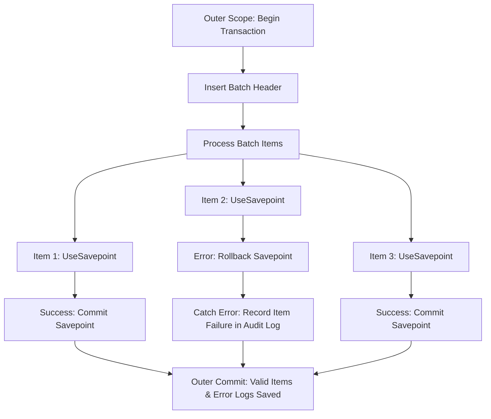

# Level 05: Nested Transactions, Savepoints & Ambient Context Flow

> **Level:** 05 | **Category:** Advanced | **Executable Reference:** [`Level5_Processing.cs`](file:///d:/DevData/ericksonlopez.dev/dotnet-transaction/samples/Showcase/Levels/Level5_Processing.cs)

---

## 1. Hierarchical Savepoint Isolation (`NestedTransactionBehavior.UseSavepoint`)

When an operation is executed within an active transaction and `NestedTransactionBehavior.UseSavepoint` is configured (the default), `TransactionManager` creates an isolated [`ISavepoint`](file:///d:/DevData/ericksonlopez.dev/dotnet-transaction/src/EricksonLopez.Transaction.Abstractions/ISavepoint.cs).

If the inner operation throws an error:
- Only the **inner savepoint** is rolled back (`ROLLBACK TO SAVEPOINT`).
- The **outer transaction** remains completely healthy and can continue processing further items before committing.



---

## 2. Code Example: Batch Processing with Partial Recovery

```csharp
await txManager.ExecuteAsync(async outerContext =>
{
    await outerContext.ExecuteAsync(
        "INSERT INTO batch_jobs VALUES (@jobId, 'Data Ingestion', 'Processing');",
        new { jobId });

    foreach (var item in items)
    {
        try
        {
            await txManager.ExecuteAsync(async itemContext =>
            {
                // Executes within an automatic SAVEPOINT
                await itemRepository.ProcessItemAsync(item, itemContext);
            }, new TransactionOptions { NestedBehavior = NestedTransactionBehavior.UseSavepoint });
        }
        catch (Exception ex)
        {
            // Only this item's savepoint was rolled back
            await outerContext.ExecuteAsync(
                "INSERT INTO job_errors VALUES (@jobId, @itemId, @msg);",
                new { jobId, itemId = item.Id, msg = ex.Message });
        }
    }
}); // Physical commit stores all successful items and recorded error logs
```

---

## 3. Ambient Context Propagation (`AsyncLocal`)

[`ITransactionManager.CurrentContext`](file:///d:/DevData/ericksonlopez.dev/dotnet-transaction/src/EricksonLopez.Transaction.Abstractions/ITransactionManager.cs) provides ambient access to the active transaction across asynchronous call stacks:

```csharp
await txManager.ExecuteAsync(async context =>
{
    // Context is active here
    ITransactionContext? active = txManager.CurrentContext; // Not null
    await NestedMethodCallAsync();
});

// After scope completion:
ITransactionContext? after = txManager.CurrentContext; // null
```
