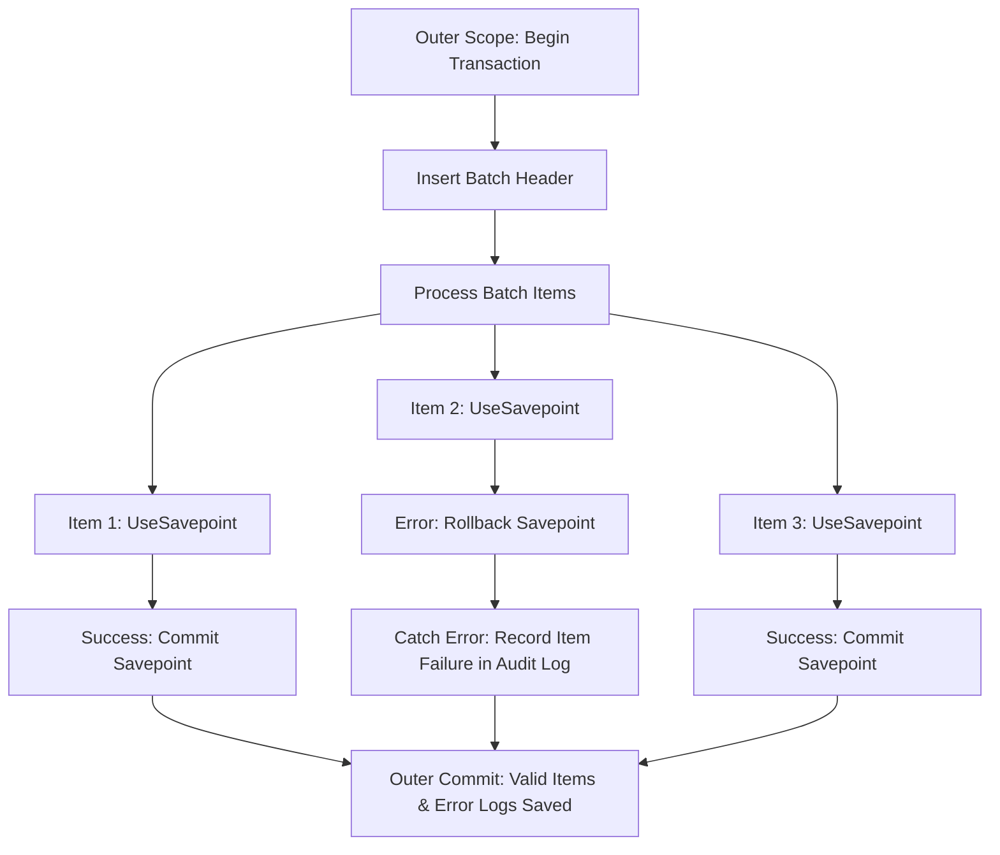

# Level 05: Nested Transactions, Savepoints & All NestedTransactionBehavior Modes

> **Level:** 05 | **Category:** Advanced | **Executable Reference:** [`Level5_Processing.cs`](file:///d:/DevData/ericksonlopez.dev/dotnet-transaction/samples/Showcase/Levels/Level5_Processing.cs)

---

## 1. Hierarchical Savepoint Isolation (`NestedTransactionBehavior.UseSavepoint`)

When an operation is executed within an active transaction and `NestedTransactionBehavior.UseSavepoint` is configured (the **default**), `TransactionManager` creates an isolated [`ISavepoint`](file:///d:/DevData/ericksonlopez.dev/dotnet-transaction/src/EricksonLopez.Transaction.Abstractions/ISavepoint.cs).

If the inner operation throws an error:
- Only the **inner savepoint** is rolled back (`ROLLBACK TO SAVEPOINT`).
- The **outer transaction** remains completely healthy and can continue processing further items before committing.



---

## 2. Code Example: Batch Processing with Partial Recovery

```csharp
await txManager.ExecuteAsync(async outerContext =>
{
    await outerContext.ExecuteAsync(
        "INSERT INTO batch_jobs VALUES (@jobId, 'Data Ingestion', 'Processing');",
        new { jobId });

    foreach (var item in items)
    {
        try
        {
            await txManager.ExecuteAsync(async itemContext =>
            {
                // Executes within an automatic SAVEPOINT
                await itemRepository.ProcessItemAsync(item, itemContext);
            }, new TransactionOptions { NestedBehavior = NestedTransactionBehavior.UseSavepoint });
        }
        catch (Exception ex)
        {
            // Only this item's savepoint was rolled back
            await outerContext.ExecuteAsync(
                "INSERT INTO job_errors VALUES (@jobId, @itemId, @msg);",
                new { jobId, itemId = item.Id, msg = ex.Message });
        }
    }
}); // Physical commit stores all successful items and recorded error logs
```

---

## 3. `NestedTransactionBehavior.JoinExisting` — Shared Physical Transaction

`JoinExisting` makes the nested scope participate in the **same physical `DbTransaction`** as the outer scope. No savepoint is created. Any exception in the inner scope rolls back the entire outer transaction.

**When to use:** Thin internal helpers that must participate in an already-active unit of work without isolation. The shared `TransactionId` proves transaction sharing.

```csharp
await txManager.ExecuteAsync(async outerCtx =>
{
    // Outer write
    await outerCtx.ExecuteAsync("INSERT INTO orders ...");

    // Inner scope joins the SAME physical transaction (no savepoint)
    await txManager.ExecuteAsync(async innerCtx =>
    {
        // innerCtx.TransactionId == outerCtx.TransactionId → true
        await innerCtx.ExecuteAsync("INSERT INTO order_items ...");

    }, new TransactionOptions { NestedBehavior = NestedTransactionBehavior.JoinExisting });
});
```

> **Important:** A failure inside the inner `JoinExisting` scope rolls back the **entire** outer transaction. There is no partial-recovery mechanism. Use `UseSavepoint` if you need isolation between the inner and outer scopes.

---

## 4. `NestedTransactionBehavior.RequireNew` — Independent Physical Transaction

`RequireNew` always opens a **new independent physical connection** and transaction, regardless of whether an ambient transaction is already active. The ambient context is suspended for the duration of the inner scope.

**When to use:** Audit logging that must always commit regardless of the outer transaction outcome, or infrastructure operations that must be durably persisted before the outer transaction commits or rolls back.

```csharp
await txManager.ExecuteAsync(async outerCtx =>
{
    await outerCtx.ExecuteAsync("INSERT INTO orders ...");

    // RequireNew: new connection + new DbTransaction — independent of outerCtx
    await txManager.ExecuteAsync(async innerCtx =>
    {
        // innerCtx.TransactionId != outerCtx.TransactionId → true
        // This commit succeeds even if the outer transaction rolls back
        await innerCtx.ExecuteAsync("INSERT INTO audit_log ...");

    }, new TransactionOptions { NestedBehavior = NestedTransactionBehavior.RequireNew });
});
```

> **SQLite Note:** SQLite in-memory shared cache uses a single-writer model. Avoid using `RequireNew` concurrently inside an active SQLite write transaction. In PostgreSQL, SQL Server, MySQL, MariaDB, and Oracle, `RequireNew` works concurrently without issue.

---

## 5. `NestedTransactionBehavior.Suppress` — Suspend Ambient Transaction

`Suppress` executes the nested scope **without any transaction enlistment**. The ambient `ITransactionContext` is `null` inside the suppressed scope. After the scope exits, the original ambient context is fully restored.

**When to use:** Non-transactional reads, cache warming, or side effects that must not be bound to the current transaction boundary.

```csharp
await txManager.ExecuteAsync(async outerCtx =>
{
    Console.WriteLine(txManager.CurrentContext is not null); // true

    // Suppress: runs WITHOUT transaction enlistment
    // NOTE: Must use Func<Task> (parameterless) — not Func<ITransactionContext, Task>
    await txManager.ExecuteAsync(async () =>
    {
        Console.WriteLine(txManager.CurrentContext is null); // true — suspended
        // Non-transactional work here
        await Task.Yield();

    }, new TransactionOptions { NestedBehavior = NestedTransactionBehavior.Suppress });

    Console.WriteLine(txManager.CurrentContext is not null); // true — restored
});
```

> **Important:** `Suppress` requires the **parameterless** `Func<Task>` (or `Func<Task<TResult>>`) delegate overload. Passing a `Func<ITransactionContext, Task>` with `Suppress` throws `InvalidOperationException`.

---

## 6. `NestedTransactionBehavior` Comparison Matrix

| Behavior | Savepoint Created | Shares Physical Tx | New Connection | Ambient Suspended |
|---|---|---|---|---|
| `UseSavepoint` (default) | ✅ Yes | ✅ Yes | ❌ No | ❌ No |
| `JoinExisting` | ❌ No | ✅ Yes | ❌ No | ❌ No |
| `RequireNew` | N/A | ❌ No | ✅ Yes | ✅ Yes |
| `Suppress` | N/A | ❌ No | ❌ No | ✅ Yes |

---

## 7. Ambient Context Propagation (`AsyncLocal`)

[`ITransactionManager.CurrentContext`](file:///d:/DevData/ericksonlopez.dev/dotnet-transaction/src/EricksonLopez.Transaction.Abstractions/ITransactionManager.cs) provides ambient access to the active transaction across asynchronous call stacks:

```csharp
await txManager.ExecuteAsync(async context =>
{
    // Context is active here
    ITransactionContext? active = txManager.CurrentContext; // Not null
    await NestedMethodCallAsync();
});

// After scope completion:
ITransactionContext? after = txManager.CurrentContext; // null
```
