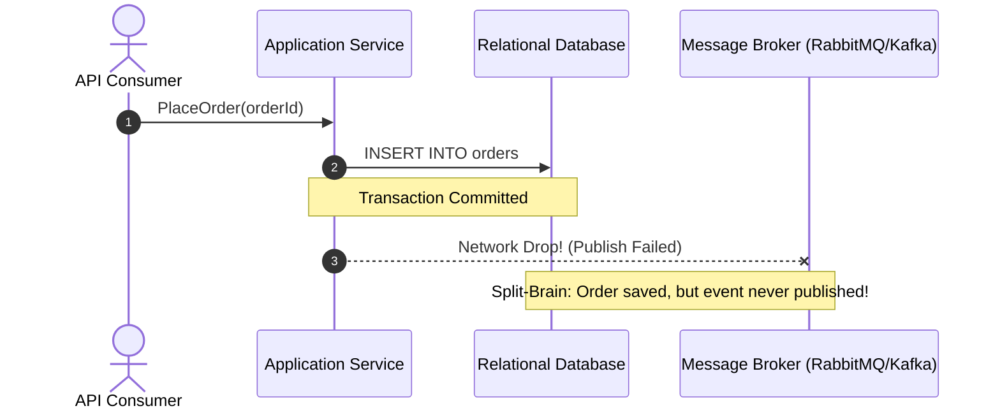
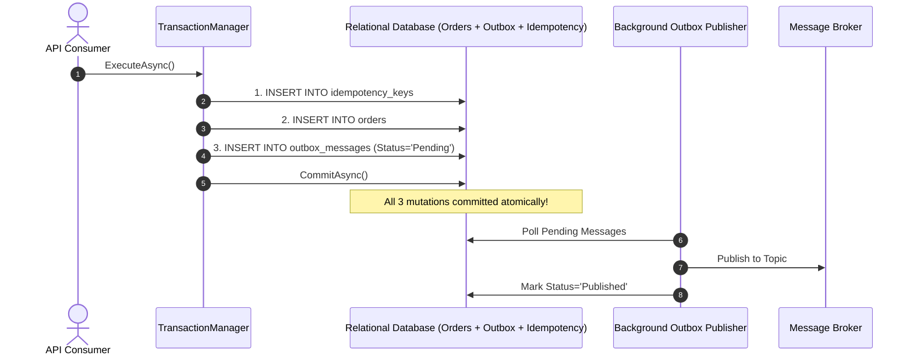

# Level 10: Enterprise Architecture: Dual-Write Outbox & Idempotency

> **Level:** 10 | **Category:** Architecture | **Executable Reference:** [`Level10_EnterpriseArchitecture.cs`](file:///d:/DevData/ericksonlopez.dev/dotnet-transaction/samples/Showcase/Levels/Level10_EnterpriseArchitecture.cs)

---

## 1. The Distributed Dual-Write Problem

In distributed microservices, persisting business state to a relational database AND directly publishing a message to a message broker (RabbitMQ/Kafka) in memory creates an unavoidable split-brain window:
- If the database commits but the network drops before message publishing: **The message is lost forever**.
- If the message publishes but the database transaction rolls back: **Downstream services process phantom state**.



---

## 2. Solution: Atomic Dual-Write via Transactional Outbox

By storing both the business entity mutation AND the domain event record in the **same physical `DbTransaction` boundary**, atomicity is 100% guaranteed:



---

## 3. Reference Implementation

```csharp
string orderId = "ord-9001";
string customerId = "cust-500";
decimal orderAmount = 2499.00m;
string idempotencyKey = "req-idempotency-abc-123";

await txManager.ExecuteAsync(async context =>
{
    // Step 1: Guard request with Idempotency Key
    await context.ExecuteAsync(
        "INSERT INTO idempotency_keys VALUES (@key, @orderId, @createdAt);",
        new { key = idempotencyKey, orderId, createdAt = DateTime.UtcNow.ToString("O") },
        cancellationToken: context.CancellationToken);

    // Step 2: Persist business aggregate
    await context.ExecuteAsync(
        "INSERT INTO orders VALUES (@orderId, @customerId, @orderAmount, 'Confirmed');",
        new { orderId, customerId, orderAmount },
        cancellationToken: context.CancellationToken);

    // Step 3: Persist Domain Event in Transactional Outbox table
    var domainEvent = new OrderPlacedEvent(orderId, customerId, orderAmount, DateTime.UtcNow);
    string payload = JsonSerializer.Serialize(domainEvent);

    await context.ExecuteAsync("""
        INSERT INTO outbox_messages (id, event_type, payload, status, created_at_utc)
        VALUES (@id, @eventType, @payload, 'Pending', @createdAt);
        """,
        new
        {
            id = Guid.NewGuid().ToString("N"),
            eventType = nameof(OrderPlacedEvent),
            payload,
            createdAt = DateTime.UtcNow.ToString("O")
        },
        cancellationToken: context.CancellationToken);
}, TransactionOptions.Default, cancellationToken);
```

---

## 4. Clean Architecture Layer Ownership Invariants
- **Application Layer (Use Cases / Handlers)**: Coordinates transaction boundaries via `ITransactionManager`.
- **Infrastructure Repositories**: Receive `ITransactionContext` and execute atomic SQL operations.
- **Outer Resilience Policies**: Wrap the entire `ExecuteAsync` invocation to handle transient retries and deadlocks.
